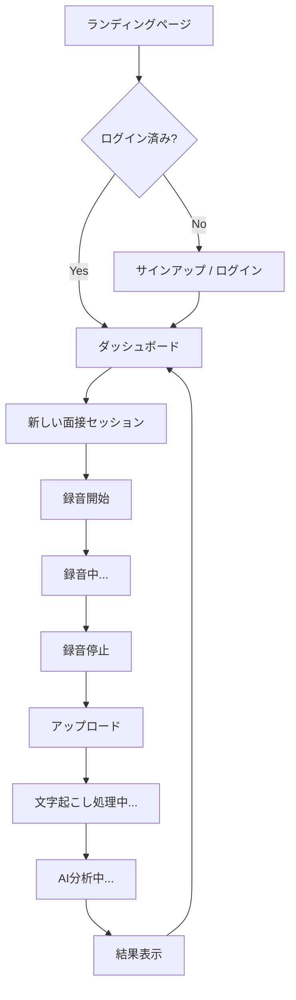

# InterviewCoach — Product Requirements Document (PRD)

## 1. 概要

### プロダクト名
InterviewCoach

### ビジョン
面接練習の質を AI で劇的に向上させ、就活生・転職者が自信を持って本番に臨めるようにする。

### 課題
- 面接練習は 1 人では改善点に気付きにくい
- プロのコーチは高額（1 回 5,000〜30,000 円）
- 録音しても自分で聞き返すだけでは具体的な改善策が得られない

### ソリューション
ブラウザで面接を録音 → AI が文字起こし（話者分離付き） → 回答内容・話し方の両面からフィードバックを自動生成

---

## 2. ターゲットユーザー

| ペルソナ | 属性 | ニーズ |
|----------|------|--------|
| 就活生（大学3-4年） | 面接経験が少ない、フィードバックを受ける機会が限られる | 回答内容の改善提案、話し方の癖の指摘 |
| 転職者（25-35歳） | 仕事が忙しく練習時間が限られる | 短時間で効率的にフィードバックを得たい |

---

## 3. MVP スコープ

### Must-have（v1.0）

#### F-1: ユーザー認証
- メール/パスワードによるサインアップ・ログイン
- Supabase Auth を使用
- 認証済みユーザーのみ機能を利用可能

#### F-2: ブラウザ録音
- MediaRecorder API でブラウザ内録音
- 録音開始 / 一時停止 / 停止の操作
- 録音時間の表示（リアルタイム）
- 対応フォーマット: WebM (Opus)

#### F-3: 音声アップロード
- 録音完了後、Supabase Storage にアップロード
- アップロード進捗の表示
- 最大ファイルサイズ: 100MB（約60分の録音）

#### F-4: 文字起こし + 話者分離
- AssemblyAI API を使用
- 話者分離（面接官 / 候補者）
- 日本語対応
- 処理状況のポーリング表示

#### F-5: AI フィードバック生成
- Claude API (Sonnet) を使用
- 以下のフィードバック項目を生成:
  - **総合評価スコア**（1-100点）
  - **要約**（面接全体の概要）
  - **回答改善提案**（各回答に対する具体的な改善案）
  - **フィラーワード検出**（「えーと」「あの」等の使用回数・箇所）
  - **強み**（良かった点のリスト）
  - **改善点**（改善すべき点のリスト）

#### F-6: 結果表示画面
- 文字起こしの時系列表示（話者別に色分け）
- フィードバックのセクション別表示
- フィラーワードのハイライト

### Nice-to-have（v2 以降）
- リアルタイム文字起こし
- Google / GitHub ソーシャルログイン
- 面接履歴ダッシュボード（過去の結果を比較）
- 課金機能（Stripe）
- 多言語対応（英語面接）
- 面接練習用の AI 質問生成
- レポートの PDF エクスポート

---

## 4. ユーザーフロー

---

## 5. 技術スタック

| レイヤー | 技術 | 備考 |
|----------|------|------|
| フロントエンド | Next.js 15 (App Router) + TypeScript + Tailwind CSS + shadcn/ui | |
| バックエンド | Next.js Server Actions + API Routes | |
| 認証 | Supabase Auth | メール/パスワード |
| データベース | Supabase PostgreSQL | RLS 必須 |
| ストレージ | Supabase Storage | 音声ファイル保存 |
| 文字起こし | AssemblyAI | 話者分離 + 日本語対応 |
| AI分析 | Claude API (Sonnet) | フィードバック生成 |
| デプロイ | Vercel | 自動デプロイ |

---

## 6. データモデル

### interviews テーブル
| カラム | 型 | 説明 |
|--------|-----|------|
| id | uuid (PK) | |
| user_id | uuid (FK → auth.users) | |
| title | text | セッションタイトル |
| audio_url | text | Supabase Storage URL |
| duration_seconds | integer | 録音時間 |
| status | text | uploaded / transcribing / analyzing / completed / error |
| created_at | timestamptz | |

### transcripts テーブル
| カラム | 型 | 説明 |
|--------|-----|------|
| id | uuid (PK) | |
| interview_id | uuid (FK → interviews) | |
| speaker | text | interviewer / interviewee |
| content | text | 発言内容 |
| start_time | float | 開始時刻（秒） |
| end_time | float | 終了時刻（秒） |

### feedbacks テーブル
| カラム | 型 | 説明 |
|--------|-----|------|
| id | uuid (PK) | |
| interview_id | uuid (FK → interviews) | |
| overall_score | integer | 1-100 |
| summary | text | 面接の要約 |
| filler_words | jsonb | フィラーワード検出結果 |
| suggestions | jsonb | 回答改善提案 |
| strengths | jsonb | 強みリスト |
| improvements | jsonb | 改善点リスト |

---

## 7. 非機能要件

| 項目 | 要件 |
|------|------|
| パフォーマンス | 文字起こし + AI分析: 録音時間の2倍以内に完了 |
| セキュリティ | RLS でユーザー間のデータ分離、API キーはサーバーサイドのみ |
| 可用性 | Vercel + Supabase の SLA に準拠 |
| 対応ブラウザ | Chrome, Edge, Safari（最新2バージョン） |
| モバイル | レスポンシブ対応（録音はPC推奨） |

---

## 8. 成功指標（MVP）

| 指標 | 目標 |
|------|------|
| ベータテスター数 | 5人以上 |
| 録音→フィードバック完了率 | 80%以上 |
| フィードバックの有用性（5段階） | 平均3.5以上 |
| 致命的バグ数 | 0件 |

---

## 9. リスクと対策

| リスク | 影響 | 対策 |
|--------|------|------|
| AssemblyAI の日本語精度が不十分 | フィードバック品質低下 | Whisper API をフォールバックとして検討 |
| 録音音質が悪い | 文字起こし精度低下 | 録音前にマイクテスト機能を追加 |
| APIコストが想定以上 | 運用コスト増 | 使用制限（月5回/無料ユーザー）を設定 |
| 面接の文脈理解が困難 | AI提案の的外れ | プロンプトの継続改善、業界/職種の入力欄追加 |
