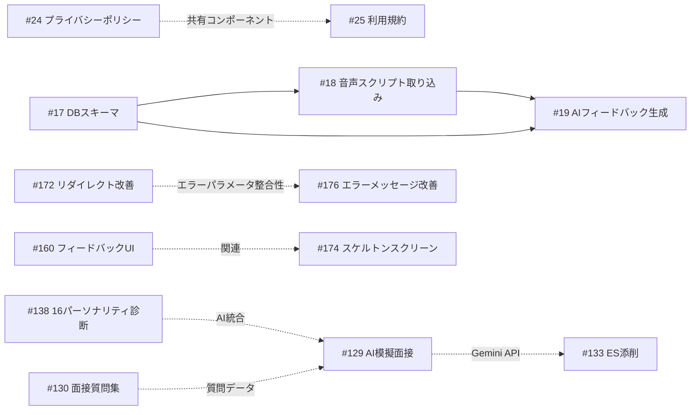

# 仕様書一覧

InterviewCoach プロジェクトの機能仕様書をまとめたディレクトリです。
既存の安定機能を文書化し、今後の変更でリグレッションが発生しないよう保護します。

## 既存機能の仕様書（Approved）

| ファイル | 機能 | ステータス | 概要 |
|----------|------|------------|------|
| [spec-questions.md](./spec-questions.md) | 面接質問集 | Approved | 面接頻出質問 90 問（8 カテゴリ）、4 種フィルタ、SSG 対応 |
| [spec-personality.md](./spec-personality.md) | 16パーソナリティ診断 | Approved | 16 タイプ（4 グループ）、10 問診断テスト、Pro/Premium 制限 |

## Sprint 5-8 で追加された機能（仕様書作成予定）

| ファイル | Issue | 機能 | ステータス |
|----------|-------|------|------------|
| spec-98-cookie-consent.md | [#98](https://github.com/aya-kurabuchi115/interview-feedback-app/issues/98) | Cookie 同意バナー | Placeholder |
| spec-102-password-reset.md | [#102](https://github.com/aya-kurabuchi115/interview-feedback-app/issues/102) | パスワードリセット | Placeholder |
| spec-80-feedback-comparison.md | [#80](https://github.com/aya-kurabuchi115/interview-feedback-app/issues/80) | フィードバック比較 | Placeholder |
| spec-105-filler-analysis.md | [#105](https://github.com/aya-kurabuchi115/interview-feedback-app/issues/105) | フィラー分析 | Placeholder |
| spec-106-annotated-transcript.md | [#106](https://github.com/aya-kurabuchi115/interview-feedback-app/issues/106) | 注釈付きトランスクリプト | Placeholder |
| spec-129-mock-interview.md | [#129](https://github.com/aya-kurabuchi115/interview-feedback-app/issues/129) | AI 模擬面接 | Placeholder |
| spec-131-pricing-improvement.md | [#131](https://github.com/aya-kurabuchi115/interview-feedback-app/issues/131) | 料金プラン改善 | Placeholder |
| spec-133-es-review.md | [#133](https://github.com/aya-kurabuchi115/interview-feedback-app/issues/133) | ES 添削機能 | Placeholder |

## Sprint 1-4 (MVP) の仕様書

| ファイル | Issue | タイトル | ステータス |
|----------|-------|----------|------------|
| [spec-17-db-schema.md](./spec-17-db-schema.md) | [#17](../../issues/17) | DBスキーマ・RLS設計 | Draft |
| [spec-18-audio-script-import.md](./spec-18-audio-script-import.md) | [#18](../../issues/18) | 音声スクリプト取り込み | Draft |
| [spec-19-ai-feedback.md](./spec-19-ai-feedback.md) | [#19](../../issues/19) | AIフィードバック生成 | Draft |
| [spec-24-privacy-policy.md](./spec-24-privacy-policy.md) | [#24](../../issues/24) | プライバシーポリシーページ作成 | Draft |
| [spec-25-terms-of-service.md](./spec-25-terms-of-service.md) | [#25](../../issues/25) | 利用規約ページ作成 | Draft |

## Sprint 10 対象の仕様書

| ファイル | Issue | タイトル | ステータス |
|----------|-------|----------|------------|
| [spec-172-auth-redirect.md](./spec-172-auth-redirect.md) | [#172](https://github.com/aya-kurabuchi115/interview-feedback-app/issues/172) | ログイン済みユーザーのリダイレクト改善 | Draft |
| [spec-176-auth-error-messages.md](./spec-176-auth-error-messages.md) | [#176](https://github.com/aya-kurabuchi115/interview-feedback-app/issues/176) | 認証コールバックのエラーメッセージ改善 | Draft |
| [spec-104-email-templates.md](./spec-104-email-templates.md) | [#104](https://github.com/aya-kurabuchi115/interview-feedback-app/issues/104) | メールテンプレートのカスタマイズ | Draft |
| [spec-160-button-feedback-ui.md](./spec-160-button-feedback-ui.md) | [#160](https://github.com/aya-kurabuchi115/interview-feedback-app/issues/160) | ボタン操作後のフィードバックUI改善 | Draft |
| [spec-132-answer-templates.md](./spec-132-answer-templates.md) | [#132](https://github.com/aya-kurabuchi115/interview-feedback-app/issues/132) | 回答テンプレート・模範解答機能 | Draft |

## 依存関係

## 仕様書のステータス

| ステータス | 説明 |
|------------|------|
| Draft | 作成済み、レビュー待ち |
| In Review | レビュー中 |
| Approved | 承認済み、実装可能 |
| Implemented | 実装完了 |

## 各仕様書の構成

1. 概要（背景・ゴール・スコープ外）
2. ユーザーストーリー
3. 機能要件（基本フロー・代替フロー・エラーフロー）
4. 受け入れ基準
5. 技術設計（アーキテクチャ・データモデル・API・UIコンポーネント）
6. 依存関係
7. テスト計画
8. リスクと緩和策
