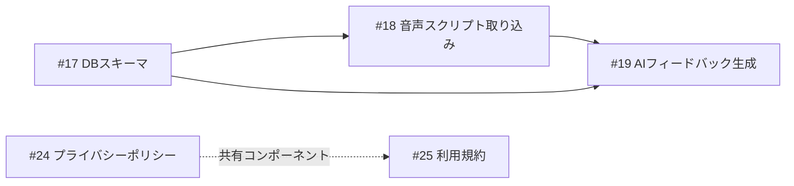

# 仕様書一覧

Sprint 2026-03-01 対象の仕様書です。

| ファイル | Issue | タイトル | ステータス |
|----------|-------|----------|------------|
| [spec-17-db-schema.md](./spec-17-db-schema.md) | [#17](../../issues/17) | DBスキーマ・RLS設計 | Draft |
| [spec-18-audio-script-import.md](./spec-18-audio-script-import.md) | [#18](../../issues/18) | 音声スクリプト取り込み | Draft |
| [spec-19-ai-feedback.md](./spec-19-ai-feedback.md) | [#19](../../issues/19) | AIフィードバック生成 | Draft |
| [spec-24-privacy-policy.md](./spec-24-privacy-policy.md) | [#24](../../issues/24) | プライバシーポリシーページ作成 | Draft |
| [spec-25-terms-of-service.md](./spec-25-terms-of-service.md) | [#25](../../issues/25) | 利用規約ページ作成 | Draft |

## 依存関係

## 仕様書のステータス

| ステータス | 説明 |
|------------|------|
| Draft | 作成済み、レビュー待ち |
| In Review | レビュー中 |
| Approved | 承認済み、実装可能 |
| Implemented | 実装完了 |

## 各仕様書の構成

1. 概要（背景・ゴール・スコープ外）
2. ユーザーストーリー
3. 機能要件（基本フロー・代替フロー・エラーフロー）
4. 受け入れ基準
5. 技術設計（アーキテクチャ・データモデル・API・UIコンポーネント）
6. 依存関係
7. テスト計画
8. リスクと緩和策
