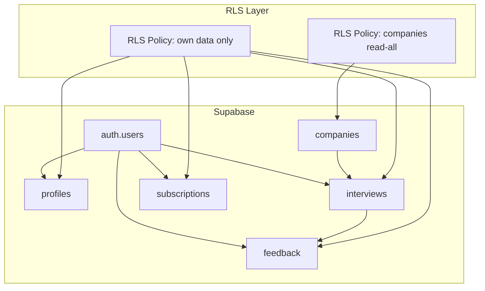

# Spec-17: DBスキーマ・RLS設計

| 項目 | 内容 |
|------|------|
| Issue | [#17 [US-11] DBスキーマ・RLS設計](../../issues/17) |
| ステータス | Draft |
| 作成日 | 2026-03-01 |
| 最終更新 | 2026-03-01 |

---

## 1. 概要

### 背景

InterviewCoach アプリケーションは、面接の音声スクリプトを AI が分析しフィードバックを生成するサービスである。全機能の基盤となるデータベーススキーマが未整備のため、profiles / interviews / feedback / subscriptions / companies の各テーブルと Row Level Security (RLS) ポリシーを設計・実装する必要がある。

### ゴール

- Supabase PostgreSQL 上に 5 テーブル（profiles, companies, interviews, feedback, subscriptions）を作成する
- 全テーブルに適切な RLS ポリシーを適用し、ユーザーが自分のデータのみにアクセスできるようにする
- 面接カテゴリ（アルバイト/インターン/新卒/その他）と企業名を管理する仕組みを構築する
- TypeScript 型定義を自動生成し、フロントエンドで型安全に利用できるようにする

### スコープ外

- 企業間の面接データ共有機能（将来的に検討）
- Stripe Webhook による subscriptions テーブルの自動更新ロジック
- フロントエンドの UI 実装

---

## 2. ユーザーストーリー

> As a 開発者, I want 堅牢なDBスキーマとRLSポリシーが設計されている so that 全機能を安全かつ効率的に実装できる.

---

## 3. 機能要件

### 3.1 基本フロー

1. Supabase CLI でマイグレーションファイルを作成する
2. ENUM 型を定義する（`interview_category`, `interview_round`）
3. 5 テーブルを CREATE TABLE で作成する
4. インデックス・制約を追加する
5. RLS ポリシーを全テーブルに適用する
6. `supabase gen types typescript` で TypeScript 型定義を生成する
7. マイグレーションを実行し、ローカル環境で動作確認する

### 3.2 代替フロー

- ENUM 型の拡張が必要になった場合: `ALTER TYPE ... ADD VALUE` で対応
- companies テーブルの正規化名が衝突した場合: ユニーク制約エラーをアプリ側でハンドリングし、既存レコードを返却

### 3.3 エラーフロー

- マイグレーション失敗時: ロールバックスクリプトを実行して前の状態に復元
- RLS ポリシー設定漏れ: テストで全テーブルの RLS 有効化を検証

---

## 4. 受け入れ基準

### テーブル定義

- [ ] `profiles` テーブルが作成されている（user_id, display_name, university, faculty, graduation_year, graduation_month, target_industry[], target_job_type[], job_hunting_status, job_hunting_start_date, preferred_work_location[], created_at, updated_at）
- [ ] `companies` テーブルが作成されている（id, name, industry, normalized_name, created_at）
- [ ] `interviews` テーブルが作成されている（id, user_id, company_id, company_name_snapshot, interview_category, interview_round, interview_date, transcript, transcript_char_count, created_at, updated_at）
- [ ] `feedback` テーブルが作成されている（id, interview_id, user_id, good_points, improvement_points, overall_score, overall_comment, category_scores, raw_response, model_version, created_at）
- [ ] `subscriptions` テーブルが作成されている（id, user_id, stripe_customer_id, stripe_subscription_id, plan, status, current_period_start, current_period_end, cancel_at, canceled_at, created_at, updated_at）

### RLS ポリシー

- [ ] 全テーブルに RLS が有効化されている
- [ ] profiles / interviews / feedback / subscriptions は自分のデータのみ CRUD 可能
- [ ] companies は全認証ユーザーが SELECT 可能、INSERT は認証ユーザー、UPDATE/DELETE は管理者のみ

### インデックス・制約

- [ ] `interviews (user_id, interview_date)` 複合インデックス
- [ ] `interviews (user_id, company_id)` 複合インデックス
- [ ] `companies.normalized_name` にユニーク制約
- [ ] `feedback.overall_score` に CHECK 制約（0-100）
- [ ] `interviews.transcript` に文字数上限 CHECK 制約（50,000文字）
- [ ] 外部キーの ON DELETE 動作が明示的に定義されている

### その他

- [ ] Supabase マイグレーションファイルとして管理されている
- [ ] TypeScript 型定義が生成・配置されている
- [ ] ロールバック用スクリプトが用意されている

---

## 5. 技術設計

### 5.1 アーキテクチャ



### 5.2 データモデル

#### ENUM 型

```sql
CREATE TYPE interview_category AS ENUM ('arubaito', 'intern', 'new_grad', 'other');
CREATE TYPE interview_round AS ENUM ('first', 'second', 'third', 'final', 'gd', 'case', 'other');
```

#### profiles テーブル

| カラム | 型 | 制約 | 説明 |
|--------|-----|------|------|
| user_id | uuid (PK, FK → auth.users) | NOT NULL | Supabase Auth ユーザーID |
| display_name | text | | 表示名 |
| university | text | | 大学名 |
| faculty | text | | 学部 |
| graduation_year | integer | | 卒業年 |
| graduation_month | integer | CHECK (1-12) | 卒業月 |
| target_industry | text[] | DEFAULT '{}' | 志望業界（配列） |
| target_job_type | text[] | DEFAULT '{}' | 志望職種（配列） |
| job_hunting_status | text | | 就活状況 |
| job_hunting_start_date | date | | 就活開始日 |
| preferred_work_location | text[] | DEFAULT '{}' | 希望勤務地（配列） |
| created_at | timestamptz | DEFAULT now() | 作成日時（UTC） |
| updated_at | timestamptz | DEFAULT now() | 更新日時（UTC） |

#### companies テーブル

| カラム | 型 | 制約 | 説明 |
|--------|-----|------|------|
| id | uuid (PK) | DEFAULT gen_random_uuid() | |
| name | text | NOT NULL | 企業名 |
| industry | text | | 業界 |
| normalized_name | text | UNIQUE, NOT NULL | 正規化名（表記揺れ防止） |
| created_at | timestamptz | DEFAULT now() | 作成日時（UTC） |

#### interviews テーブル

| カラム | 型 | 制約 | 説明 |
|--------|-----|------|------|
| id | uuid (PK) | DEFAULT gen_random_uuid() | |
| user_id | uuid (FK → auth.users) | NOT NULL, ON DELETE CASCADE | |
| company_id | uuid (FK → companies) | ON DELETE SET NULL | |
| company_name_snapshot | text | NOT NULL | 登録時点の企業名 |
| interview_category | interview_category | NOT NULL | 面接カテゴリ |
| interview_round | interview_round | | 面接ラウンド（新卒時に使用） |
| interview_date | date | | 面接日 |
| transcript | text | CHECK (char_length <= 50000) | 音声スクリプト |
| transcript_char_count | integer | | スクリプト文字数 |
| created_at | timestamptz | DEFAULT now() | |
| updated_at | timestamptz | DEFAULT now() | |

#### feedback テーブル

| カラム | 型 | 制約 | 説明 |
|--------|-----|------|------|
| id | uuid (PK) | DEFAULT gen_random_uuid() | |
| interview_id | uuid (FK → interviews) | NOT NULL, ON DELETE CASCADE | |
| user_id | uuid (FK → auth.users) | NOT NULL, ON DELETE CASCADE | |
| good_points | text | | 良い点 |
| improvement_points | text | | 改善点 |
| overall_score | integer | CHECK (0-100) | 総合スコア |
| overall_comment | text | | 総合コメント |
| category_scores | jsonb | | カテゴリ別スコア |
| raw_response | text | | API 生レスポンス |
| model_version | text | | 使用AIモデルバージョン |
| created_at | timestamptz | DEFAULT now() | |

#### subscriptions テーブル

| カラム | 型 | 制約 | 説明 |
|--------|-----|------|------|
| id | uuid (PK) | DEFAULT gen_random_uuid() | |
| user_id | uuid (FK → auth.users) | NOT NULL, UNIQUE, ON DELETE CASCADE | |
| stripe_customer_id | text | | Stripe 顧客ID |
| stripe_subscription_id | text | | Stripe サブスクリプションID |
| plan | text | NOT NULL, DEFAULT 'free' | プラン名 |
| status | text | NOT NULL, DEFAULT 'active' | ステータス |
| current_period_start | timestamptz | | 現在の期間開始日 |
| current_period_end | timestamptz | | 現在の期間終了日 |
| cancel_at | timestamptz | | 解約予定日 |
| canceled_at | timestamptz | | 解約日 |
| created_at | timestamptz | DEFAULT now() | |
| updated_at | timestamptz | DEFAULT now() | |

### 5.3 RLS ポリシー設計

```sql
-- profiles: 自分のデータのみ
CREATE POLICY "profiles_select_own" ON profiles FOR SELECT USING (auth.uid() = user_id);
CREATE POLICY "profiles_insert_own" ON profiles FOR INSERT WITH CHECK (auth.uid() = user_id);
CREATE POLICY "profiles_update_own" ON profiles FOR UPDATE USING (auth.uid() = user_id);

-- companies: 全認証ユーザーが SELECT、INSERT は認証ユーザー
CREATE POLICY "companies_select_all" ON companies FOR SELECT USING (auth.role() = 'authenticated');
CREATE POLICY "companies_insert_auth" ON companies FOR INSERT WITH CHECK (auth.role() = 'authenticated');

-- interviews: 自分のデータのみ
CREATE POLICY "interviews_select_own" ON interviews FOR SELECT USING (auth.uid() = user_id);
CREATE POLICY "interviews_insert_own" ON interviews FOR INSERT WITH CHECK (auth.uid() = user_id);
CREATE POLICY "interviews_update_own" ON interviews FOR UPDATE USING (auth.uid() = user_id);
CREATE POLICY "interviews_delete_own" ON interviews FOR DELETE USING (auth.uid() = user_id);

-- feedback / subscriptions も同様
```

### 5.4 インデックス

```sql
CREATE INDEX idx_interviews_user_date ON interviews (user_id, interview_date);
CREATE INDEX idx_interviews_user_company ON interviews (user_id, company_id);
CREATE INDEX idx_feedback_interview ON feedback (interview_id);
CREATE INDEX idx_subscriptions_user ON subscriptions (user_id);
```

### 5.5 マイグレーション構成

```
supabase/migrations/
├── 20260301000001_create_enums.sql
├── 20260301000002_create_profiles.sql
├── 20260301000003_create_companies.sql
├── 20260301000004_create_interviews.sql
├── 20260301000005_create_feedback.sql
├── 20260301000006_create_subscriptions.sql
├── 20260301000007_create_indexes.sql
└── 20260301000008_create_rls_policies.sql
```

### 5.6 TypeScript 型定義

`supabase gen types typescript` で `src/types/database.types.ts` に自動生成。

---

## 6. 依存関係

| 依存先 | 種別 | 説明 |
|--------|------|------|
| Supabase プロジェクト | インフラ | DB ホスト環境 |
| Supabase CLI | ツール | マイグレーション管理 |

**他の Issue からの依存:**
- #18（音声スクリプト取り込み）→ 本 Issue の interviews テーブルに依存
- #19（AIフィードバック生成）→ 本 Issue の feedback テーブルに依存

---

## 7. テスト計画

| テスト種別 | 内容 | 方法 |
|------------|------|------|
| マイグレーション | 全マイグレーションが正常に適用される | `supabase db reset` で検証 |
| ロールバック | ロールバックスクリプトが正常動作する | 逆順マイグレーション実行 |
| RLS SELECT | 自分のデータのみ取得できる | SQL テストクエリ |
| RLS INSERT | 他人の user_id で INSERT できない | SQL テストクエリ |
| RLS companies | 全認証ユーザーが SELECT 可能 | SQL テストクエリ |
| CHECK 制約 | overall_score が 0-100 範囲外で INSERT 失敗 | SQL テストクエリ |
| CHECK 制約 | transcript が 50,000 文字超で INSERT 失敗 | SQL テストクエリ |
| ユニーク制約 | normalized_name の重複で INSERT 失敗 | SQL テストクエリ |
| 外部キー | CASCADE/RESTRICT が期待通り動作する | SQL テストクエリ |
| 型定義 | TypeScript 型が正常に生成される | `supabase gen types typescript` 実行 |

---

## 8. リスクと緩和策

| リスク | 影響度 | 発生確率 | 緩和策 |
|--------|--------|----------|--------|
| ENUM 型の変更が破壊的になる | 高 | 中 | ADD VALUE のみ使用し、既存値は削除しない。将来の拡張に備えコメントを記載 |
| RLS ポリシーの設定漏れ | 高 | 低 | テストで全テーブルの RLS 有効化を自動検証 |
| マイグレーションのロールバック失敗 | 中 | 低 | 各マイグレーションに対応するロールバックスクリプトを事前作成 |
| category_scores の JSONB スキーマ不整合 | 中 | 中 | アプリ層で Zod バリデーションを実施し、DB には柔軟な JSONB で保存 |
| タイムゾーン混在によるデータ不整合 | 中 | 中 | 全カラムを timestamptz（UTC）で統一、アプリ側で JST 変換 |
