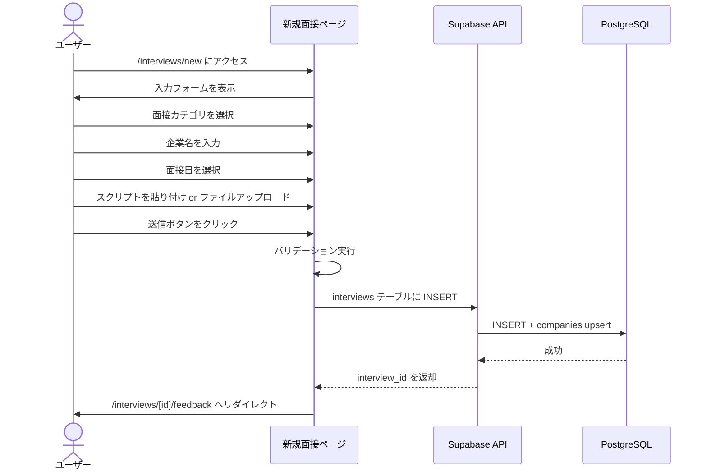
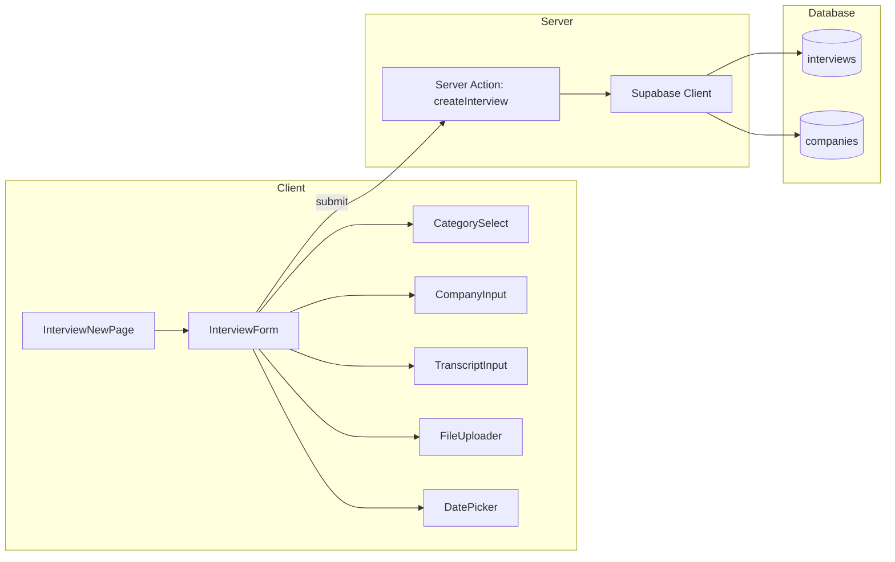

# Spec-18: 音声スクリプト取り込み

| 項目 | 内容 |
|------|------|
| Issue | [#18 [US-12] 音声スクリプト取り込み](../../issues/18) |
| ステータス | Draft |
| 作成日 | 2026-03-01 |
| 最終更新 | 2026-03-01 |

---

## 1. 概要

### 背景

InterviewCoach のコア機能であるAIフィードバック生成のためには、面接の音声文字起こしテキストをシステムに取り込む必要がある。ユーザーは外部ツール（CLOVA Note、notta 等）で作成した文字起こし結果を持っており、それをアプリに登録する導線が求められている。

### ゴール

- テキストエリアへの直接貼り付けと .txt ファイルアップロードの 2 つの入力方法を提供する
- 面接カテゴリ（アルバイト/インターン/新卒/その他）と企業名を必須フィールドとして登録する
- 新卒面接の場合は面接ラウンド（一次/二次/三次/最終/GD/ケース/その他）も選択できるようにする
- interviews テーブルにデータを保存し、AIフィードバック生成画面へスムーズに遷移する

### スコープ外

- ブラウザ内録音機能（F-2 として別途対応）
- リアルタイム文字起こし機能
- 音声ファイルの直接アップロード（.mp3, .wav 等）
- 複数ファイルの一括アップロード

---

## 2. ユーザーストーリー

> As a 就活生, I want 面接の音声文字起こし結果を簡単に取り込める so that AIフィードバックを受けるための準備ができる.

---

## 3. 機能要件

### 3.1 基本フロー



### 3.2 代替フロー

- **ファイルアップロードによる入力**: ユーザーが .txt ファイルをファイル選択ダイアログまたはドラッグ&ドロップで取り込む。ファイル内容がテキストエリアに反映され、以降は基本フローと同様
- **企業名サジェスト選択**: 企業名入力時に過去に登録された企業名の候補が表示され、選択すると company_id が自動設定される
- **下書き復元**: ネットワーク切断等で保存に失敗した場合、再訪問時にローカルストレージから下書きを復元する

### 3.3 エラーフロー

| エラー条件 | 表示メッセージ | 対処 |
|------------|----------------|------|
| 面接カテゴリ未選択 | 「面接カテゴリを選択してください」 | インラインエラー表示 |
| 企業名未入力 | 「企業名を入力してください」 | インラインエラー表示 |
| スクリプト未入力 | 「音声スクリプトを入力してください」 | インラインエラー表示 |
| スクリプト 100 文字未満 | 「100文字以上入力してください。短いスクリプトではフィードバック品質が低下します」 | 警告表示（送信は可能） |
| スクリプト 50,000 文字超過 | 「50,000文字以内で入力してください」 | インラインエラー表示、送信不可 |
| 企業名 100 文字超過 | 「企業名は100文字以内で入力してください」 | インラインエラー表示 |
| 面接日が未来 | 「面接日に未来の日付は設定できません」 | インラインエラー表示 |
| .txt 以外のファイル | 「.txt ファイルのみアップロード可能です」 | エラーメッセージ表示 |
| ファイルサイズ 1MB 超過 | 「ファイルサイズは1MB以下にしてください」 | エラーメッセージ表示 |
| UTF-8 以外のエンコーディング | 「文字化けが検出されました。UTF-8 形式で保存し直してください」 | 警告表示 |
| ネットワークエラー | 「保存に失敗しました。入力内容は下書きとして保存されています」 | リトライボタン表示 |
| セッション切れ | 「セッションが切れました。ログインし直してください」 | ログインページへリダイレクト（未保存警告付き） |

---

## 4. 受け入れ基準

### 基本入力機能

- [ ] テキストエリアに音声文字起こし結果を貼り付けて登録できる
- [ ] .txt ファイルをアップロードして文字起こし結果を取り込める
- [ ] ドラッグ&ドロップでのファイルアップロードに対応する

### 面接カテゴリ・企業名フィールド

- [ ] 面接カテゴリを選択できる（アルバイト / インターン / 新卒 / その他）
- [ ] 「新卒」選択時に面接ラウンドフィールドが表示される
- [ ] 「新卒」以外では面接ラウンドフィールドが非表示になる
- [ ] 企業名を入力できる（必須フィールド）
- [ ] 過去に登録した企業名のサジェストが表示される
- [ ] 面接日を選択できる（デフォルト: 当日）

### バリデーション

- [ ] 必須項目チェック（面接カテゴリ、企業名、音声スクリプト）
- [ ] 文字数上限チェック（50,000文字）
- [ ] 最低文字数チェック（100文字、警告のみ）
- [ ] 企業名の文字数制限（1-100文字）
- [ ] 面接日の未来日付チェック
- [ ] ファイル形式チェック（.txt のみ）
- [ ] ファイルサイズチェック（1MB以下）

### データ保存

- [ ] interviews テーブルへの保存が成功する
- [ ] companies テーブルに upsert される（normalized_name で重複チェック）
- [ ] 保存成功後、AIフィードバック生成画面へ遷移する

### UI/UX

- [ ] レスポンシブ対応（モバイル対応）
- [ ] ローディング状態の表示
- [ ] 二重送信防止
- [ ] ローカルストレージによる下書き保存
- [ ] アクセシビリティ対応（ラベル、aria 属性、キーボード操作）

---

## 5. 技術設計

### 5.1 アーキテクチャ



### 5.2 ページ・ルート構成

| パス | コンポーネント | 説明 |
|------|----------------|------|
| `/app/interviews/new/page.tsx` | InterviewNewPage | 新規面接登録ページ（Server Component） |

### 5.3 UIコンポーネント

| コンポーネント | ファイルパス | Props | 説明 |
|----------------|-------------|-------|------|
| InterviewForm | `src/components/interview/InterviewForm.tsx` | onSubmit, isLoading | メインフォーム |
| CategorySelect | `src/components/interview/CategorySelect.tsx` | value, onChange | 面接カテゴリ選択 |
| RoundSelect | `src/components/interview/RoundSelect.tsx` | value, onChange, visible | 面接ラウンド選択 |
| CompanyInput | `src/components/interview/CompanyInput.tsx` | value, onChange, suggestions | 企業名入力 + サジェスト |
| TranscriptInput | `src/components/interview/TranscriptInput.tsx` | value, onChange, charCount | テキストエリア |
| FileUploader | `src/components/interview/FileUploader.tsx` | onFileLoad | ドラッグ&ドロップ対応 |

### 5.4 Server Action

```typescript
// src/app/interviews/new/actions.ts
"use server"

interface CreateInterviewInput {
  interviewCategory: InterviewCategory;
  interviewRound?: InterviewRound;
  companyName: string;
  interviewDate: string;
  transcript: string;
}

export async function createInterview(input: CreateInterviewInput): Promise<{ id: string }> {
  // 1. サーバーサイドバリデーション
  // 2. companies テーブルに upsert (normalized_name で判定)
  // 3. interviews テーブルに INSERT
  // 4. interview_id を返却
}
```

### 5.5 企業名正規化ロジック

```typescript
function normalizeName(name: string): string {
  return name
    .trim()
    .replace(/[（）]/g, (c) => c === '（' ? '(' : ')')  // 全角括弧を半角に
    .replace(/\s+/g, ' ')                                // 連続空白を統一
    .replace(/株式会社|（株）|\(株\)/g, '')               // 法人格を除去
    .toLowerCase();
}
```

### 5.6 ローカルストレージ下書き保存

```typescript
// キー: 'interview_draft'
// 保存タイミング: フォーム値変更時（debounce 1秒）
// 復元タイミング: ページ読み込み時
// 削除タイミング: 送信成功時
```

---

## 6. 依存関係

| 依存先 | 種別 | 説明 |
|--------|------|------|
| #17 DBスキーマ・RLS設計 | 前提 | interviews, companies テーブルが存在すること |
| Supabase Auth | 認証 | ログイン済みユーザーのみアクセス可能 |
| shadcn/ui | UI | Select, Input, Textarea, Button 等 |

**後続 Issue:**
- #19（AIフィードバック生成）→ 本 Issue で保存した interview データを使用

---

## 7. テスト計画

| テスト種別 | テスト内容 | 方法 |
|------------|-----------|------|
| ユニットテスト | normalizeName 関数の正規化ロジック | Vitest |
| ユニットテスト | バリデーションロジック（文字数、日付、ファイル形式） | Vitest |
| コンポーネントテスト | CategorySelect: 新卒選択時に RoundSelect が表示される | React Testing Library |
| コンポーネントテスト | TranscriptInput: 文字数カウント表示 | React Testing Library |
| コンポーネントテスト | FileUploader: .txt ファイル読み込み | React Testing Library |
| コンポーネントテスト | FileUploader: 非 .txt ファイル拒否 | React Testing Library |
| 統合テスト | フォーム送信 → interviews テーブル INSERT 成功 | Vitest + Supabase Local |
| 統合テスト | companies テーブルへの upsert | Vitest + Supabase Local |
| E2Eテスト | 全フローの通し実行（入力 → 保存 → 遷移） | Playwright |
| E2Eテスト | 下書き保存・復元 | Playwright |
| 手動テスト | ドラッグ&ドロップ（主要ブラウザ） | 手動 |
| 手動テスト | モバイルレスポンシブ確認 | 手動 |

---

## 8. リスクと緩和策

| リスク | 影響度 | 発生確率 | 緩和策 |
|--------|--------|----------|--------|
| 大量テキスト貼り付け時のブラウザフリーズ | 中 | 中 | テキストエリアの onChange に debounce（300ms）を適用。文字数カウントは別スレッド（Web Worker）を検討 |
| UTF-8 以外のファイルエンコーディング | 低 | 中 | TextDecoder で UTF-8 デコードを試み、失敗時に警告を表示。Shift_JIS 等の自動変換は v1 ではスコープ外 |
| 企業名の正規化精度 | 中 | 高 | v1 では基本的な正規化（法人格除去・半角統一）のみ。将来的に外部 API（法人番号システム）との連携を検討 |
| ローカルストレージの容量制限 | 低 | 低 | 最大 50,000 文字程度のため問題なし。保存失敗時はサイレントに無視 |
| セッション切れ時のデータ消失 | 高 | 中 | ローカルストレージに下書きを保持し、ログイン後に復元を促す |
