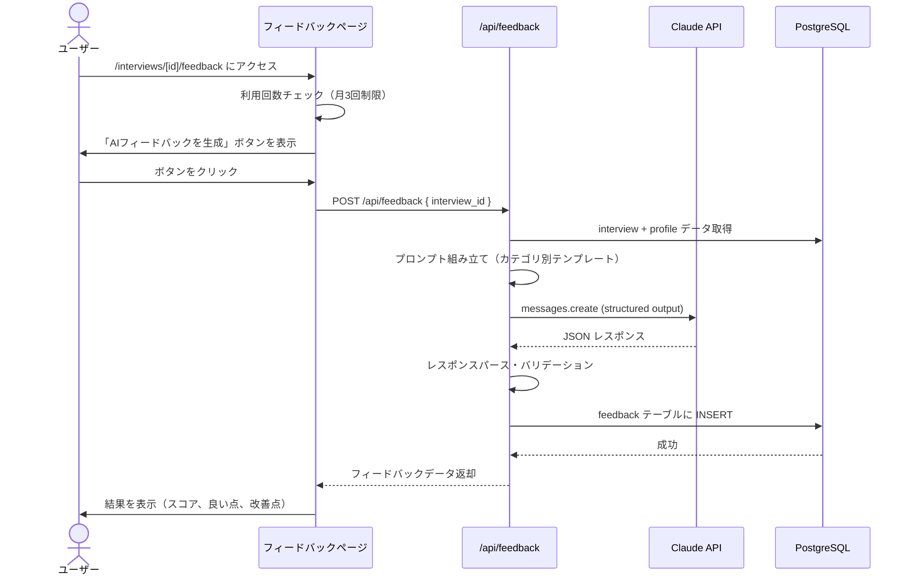
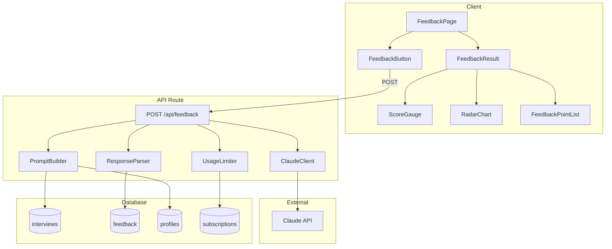

# Spec-19: AIフィードバック生成

| 項目 | 内容 |
|------|------|
| Issue | [#19 [US-13] AIフィードバック生成](../../issues/19) |
| ステータス | Draft |
| 作成日 | 2026-03-01 |
| 最終更新 | 2026-03-01 |

---

## 1. 概要

### 背景

InterviewCoach のコアバリューは、面接の音声スクリプトを AI が分析し、具体的なフィードバックを提供することにある。ユーザーがアップロードした音声スクリプトに対して、Claude API を使用した構造化フィードバック（良い点・改善点・総合スコア・カテゴリ別スコア）を生成し、就活生が面接力を客観的に把握・改善できるようにする。

### ゴール

- Claude API を使用して面接スクリプトを分析し、JSON 構造化フィードバックを生成する
- 面接カテゴリ（アルバイト/インターン/新卒）に応じた評価基準の動的調整を行う
- ユーザーのプロフィール情報（志望業界・職種）を活用したパーソナライズ分析を提供する
- フィードバック結果を視覚的にわかりやすく表示する（スコアゲージ、レーダーチャート、色分け）
- 無料プランの月3回制限を適切に管理する

### スコープ外

- リアルタイムストリーミング分析（v1 ではリクエスト/レスポンス方式）
- 英語面接のフィードバック
- 過去のフィードバックとの比較ダッシュボード
- フィードバックの PDF エクスポート

---

## 2. ユーザーストーリー

> As a 就活生, I want 面接の音声スクリプトをAIが分析してフィードバックをくれる so that 自分の面接の良い点・改善点を客観的に把握できる.

---

## 3. 機能要件

### 3.1 基本フロー



### 3.2 代替フロー

- **再分析**: 同一面接に対して再度フィードバックを生成する場合、既存フィードバックは上書きせず履歴として保持する。最新のフィードバックを優先表示する
- **プロフィール未設定時**: プロフィール情報なしでも基本的なフィードバックは生成可能。「プロフィールを設定するとより精度の高いフィードバックが得られます」と表示
- **利用制限到達後**: アップグレード導線を表示（サブスクリプション未実装時は「Pro プランは近日公開」メッセージ）

### 3.3 エラーフロー

| エラー条件 | 表示メッセージ | 対処 |
|------------|----------------|------|
| 月3回の利用制限到達 | 「今月の無料利用回数（3回）に達しました」 | アップグレード導線表示 |
| Claude API タイムアウト（30秒） | 「分析に時間がかかっています。もう一度お試しください」 | リトライボタン表示 |
| Claude API エラー（500系） | 「一時的なエラーが発生しました。再度お試しください」 | 自動リトライ（最大3回、exponential backoff） |
| レート制限（429） | 「しばらく待ってから再度お試しください」 | リトライ待ち時間表示 |
| JSON パース失敗 | 内部的にリトライ（ユーザーには見せない） | 最大2回リトライ、失敗時はエラー表示 |
| ネットワーク切断 | 「ネットワークに接続できません」 | リトライボタン表示 |
| スクリプトが短すぎる（100文字未満） | 「スクリプトが短すぎます。フィードバックの品質が低下する可能性があります」 | 警告表示（続行可能） |

---

## 4. 受け入れ基準

### AI分析コア機能

- [ ] Claude API に音声スクリプトを送信してフィードバックを取得できる
- [ ] フィードバックが構造化JSON で出力される（good_points[], improvement_points[], overall_score, overall_comment, category_scores）
- [ ] 各ポイントにカテゴリタグが付与される（論理性、具体性、熱意、マナー、質問対応）
- [ ] 面接カテゴリに応じた評価基準が適用される
- [ ] プロフィール情報を活用したパーソナライズが機能する
- [ ] 企業名を含めた業界特性に応じたフィードバックが生成される

### データ保存

- [ ] feedback テーブルへの保存が成功する
- [ ] model_version に使用モデル名が記録される
- [ ] category_scores に JSONB でスコアが保存される
- [ ] 再分析時に履歴が保持される（上書きではない）

### UI/UX

- [ ] ローディング表示（プログレスバー）が表示される
- [ ] 良い点は緑系、改善点は黄系で色分けされる
- [ ] 総合スコアがゲージまたはサークルプログレスで表示される
- [ ] カテゴリ別スコアのレーダーチャートが表示される

### 利用制限

- [ ] 無料プランの月3回制限が正しくチェックされる
- [ ] 制限到達時にアップグレード導線が表示される
- [ ] 月次カウントが毎月1日 UTC 0:00 にリセットされる

### エラーハンドリング

- [ ] API エラー時に最大3回リトライ（exponential backoff）される
- [ ] タイムアウト（30秒）時にユーザーに通知される
- [ ] レート制限到達時に適切なメッセージが表示される

---

## 5. 技術設計

### 5.1 アーキテクチャ



### 5.2 API ルート

```
POST /api/feedback
```

**リクエスト:**
```typescript
interface FeedbackRequest {
  interview_id: string;
}
```

**レスポンス:**
```typescript
interface FeedbackResponse {
  id: string;
  overall_score: number;       // 0-100
  overall_comment: string;
  good_points: FeedbackPoint[];
  improvement_points: FeedbackPoint[];
  category_scores: CategoryScores;
  model_version: string;
  created_at: string;
}

interface FeedbackPoint {
  content: string;
  category: 'logic' | 'specificity' | 'enthusiasm' | 'manner' | 'question_handling';
  excerpt?: string;  // スクリプトからの引用
}

interface CategoryScores {
  logic: number;          // 論理性 (0-100)
  specificity: number;    // 具体性 (0-100)
  enthusiasm: number;     // 熱意 (0-100)
  manner: number;         // マナー (0-100)
  question_handling: number; // 質問対応 (0-100)
}
```

### 5.3 プロンプト設計

#### 基本構造

```
[システムプロンプト]
  - 役割定義（面接コーチ）
  - 出力フォーマット（JSON スキーマ）
  - 評価基準

[ユーザープロンプト]
  - 面接カテゴリ
  - 面接ラウンド（新卒の場合）
  - 企業名
  - ユーザープロフィール（志望業界・職種）
  - 音声スクリプト本文
```

#### カテゴリ別評価ウェイト

| カテゴリ | 論理性 | 具体性 | 熱意 | マナー | 質問対応 |
|----------|--------|--------|------|--------|----------|
| アルバイト | 15% | 15% | 20% | 30% | 20% |
| インターン | 25% | 20% | 25% | 15% | 15% |
| 新卒（一次） | 20% | 15% | 20% | 25% | 20% |
| 新卒（最終） | 25% | 25% | 25% | 10% | 15% |

#### Claude API 呼び出しパラメータ

```typescript
const response = await anthropic.messages.create({
  model: "claude-sonnet-4-20250514",
  max_tokens: 4096,
  messages: [
    { role: "user", content: userPrompt }
  ],
  system: systemPrompt,
});
```

### 5.4 利用回数制限ロジック

```typescript
async function checkUsageLimit(userId: string): Promise<{ allowed: boolean; remaining: number }> {
  const startOfMonth = new Date();
  startOfMonth.setUTCDate(1);
  startOfMonth.setUTCHours(0, 0, 0, 0);

  const { count } = await supabase
    .from('feedback')
    .select('id', { count: 'exact' })
    .eq('user_id', userId)
    .gte('created_at', startOfMonth.toISOString());

  const FREE_LIMIT = 3;
  // subscription が Pro の場合は無制限
  return {
    allowed: count < FREE_LIMIT,
    remaining: Math.max(0, FREE_LIMIT - count),
  };
}
```

### 5.5 UIコンポーネント

| コンポーネント | ファイルパス | 説明 |
|----------------|-------------|------|
| FeedbackPage | `src/app/interviews/[id]/feedback/page.tsx` | フィードバックページ（Server Component） |
| FeedbackButton | `src/components/feedback/FeedbackButton.tsx` | 生成トリガーボタン |
| FeedbackResult | `src/components/feedback/FeedbackResult.tsx` | 結果表示コンテナ |
| ScoreGauge | `src/components/feedback/ScoreGauge.tsx` | 総合スコア表示（サークルプログレス） |
| RadarChart | `src/components/feedback/RadarChart.tsx` | カテゴリ別スコア（SVG レーダーチャート） |
| FeedbackPointList | `src/components/feedback/FeedbackPointList.tsx` | 良い点・改善点リスト |
| UsageLimitBanner | `src/components/feedback/UsageLimitBanner.tsx` | 利用制限通知バナー |

### 5.6 リトライロジック

```typescript
async function callClaudeWithRetry(prompt: string, maxRetries = 3): Promise<FeedbackResponse> {
  for (let attempt = 0; attempt < maxRetries; attempt++) {
    try {
      const response = await callClaude(prompt);
      return parseFeedbackResponse(response);
    } catch (error) {
      if (attempt === maxRetries - 1) throw error;
      const delay = Math.pow(2, attempt) * 1000; // 1s, 2s, 4s
      await new Promise(resolve => setTimeout(resolve, delay));
    }
  }
  throw new Error('Max retries exceeded');
}
```

---

## 6. 依存関係

| 依存先 | 種別 | 説明 |
|--------|------|------|
| #17 DBスキーマ・RLS設計 | 前提 | feedback, interviews, profiles テーブルが存在すること |
| #18 音声スクリプト取り込み | 前提 | 分析対象の interview データが存在すること |
| Claude API (Anthropic) | 外部API | AI フィードバック生成 |
| @anthropic-ai/sdk | npm | Claude API クライアント |

---

## 7. テスト計画

| テスト種別 | テスト内容 | 方法 |
|------------|-----------|------|
| ユニットテスト | PromptBuilder: カテゴリ別プロンプト生成 | Vitest |
| ユニットテスト | ResponseParser: JSON パース・バリデーション | Vitest |
| ユニットテスト | UsageLimiter: 月次カウントロジック | Vitest |
| ユニットテスト | リトライロジック: exponential backoff | Vitest（タイマーモック） |
| コンポーネントテスト | ScoreGauge: スコア値の表示 | React Testing Library |
| コンポーネントテスト | RadarChart: 5軸の描画 | React Testing Library |
| コンポーネントテスト | FeedbackPointList: 良い点/改善点の色分け | React Testing Library |
| コンポーネントテスト | UsageLimitBanner: 制限到達時の表示 | React Testing Library |
| 統合テスト | API Route: 正常系フロー全体 | Vitest（Claude API モック） |
| 統合テスト | API Route: 利用制限チェック | Vitest |
| 統合テスト | API Route: エラーハンドリング | Vitest |
| E2Eテスト | 全フロー通し実行 | Playwright（Claude API モック） |
| 手動テスト | フィードバック品質確認（実データ） | 手動 |
| 手動テスト | レーダーチャートの視覚確認 | 手動 |

---

## 8. リスクと緩和策

| リスク | 影響度 | 発生確率 | 緩和策 |
|--------|--------|----------|--------|
| Claude API のレスポンスが構造化 JSON に従わない | 高 | 中 | システムプロンプトで JSON スキーマを厳密に指定。パース失敗時は最大2回リトライし、それでも失敗した場合はフォールバック表示 |
| API コスト超過 | 高 | 中 | 月3回制限の厳格な適用。max_tokens を 4096 に制限。コスト監視アラートを設定 |
| レスポンス遅延（30秒以上） | 中 | 中 | タイムアウト設定（30秒）とプログレスバーで体感待ち時間を軽減。将来的にストリーミング対応を検討 |
| フィードバック品質のバラつき | 中 | 高 | プロンプトの A/B テスト・継続改善。model_version をフィードバック毎に記録し、品質追跡を可能にする |
| 不適切なコンテンツの送信 | 低 | 低 | Claude API の built-in セーフティフィルタに依存。必要に応じてアプリ側でプレフィルタを追加 |
| 同時リクエストの競合 | 中 | 低 | API Route でリクエスト単位のロック（interview_id + user_id）を実装。二重リクエストは後発を拒否 |
