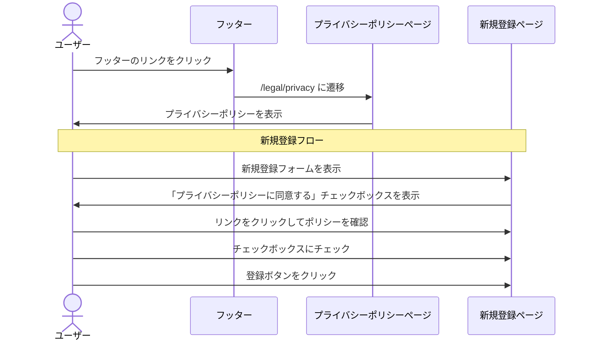

# Spec-24: プライバシーポリシーページ作成

| 項目 | 内容 |
|------|------|
| Issue | [#24 [US-18] プライバシーポリシーページ作成](../../issues/24) |
| ステータス | Draft |
| 作成日 | 2026-03-01 |
| 最終更新 | 2026-03-01 |

---

## 1. 概要

### 背景

InterviewCoach は、面接の音声スクリプトやプロフィール情報（大学名、志望業界等）といった個人情報を取り扱うサービスである。また、AI 分析のために Claude API（Anthropic）へデータを送信し、将来的には Stripe を通じた決済も行う。個人情報保護法への準拠と、ユーザーの信頼確保のためにプライバシーポリシーの明示が必須となる。

### ゴール

- 個人情報保護法に準拠したプライバシーポリシーページを `/legal/privacy` に作成する
- 収集する情報の範囲、利用目的、第三者提供先を明確に記載する
- 大学生がメインユーザーのため、わかりやすい日本語で記載する
- ユーザー登録フローに同意チェックボックスを組み込む

### スコープ外

- Cookie 同意バナー（v1 では静的ページのみ）
- GDPR 対応（国内ユーザーを主な対象とするため）
- 個人情報の開示・削除請求フォームの実装（v1 ではメール窓口案内のみ）

---

## 2. ユーザーストーリー

> As a ユーザー, I want プライバシーポリシーを確認できる so that 自分の個人情報がどのように取り扱われるか把握した上で安心してサービスを利用できる.

---

## 3. 機能要件

### 3.1 基本フロー



### 3.2 代替フロー

- **直接 URL アクセス**: `/legal/privacy` に直接アクセスしても問題なく表示される（認証不要）
- **目次からのジャンプ**: ページ上部の目次リンクから各セクションへスクロールできる
- **印刷**: ブラウザの印刷機能で適切にフォーマットされた文書が出力される

### 3.3 エラーフロー

| エラー条件 | 表示メッセージ | 対処 |
|------------|----------------|------|
| 新規登録時に同意チェックなし | 「プライバシーポリシーへの同意が必要です」 | チェックボックス横にエラー表示、登録ボタン無効化 |

---

## 4. 受け入れ基準

### 必須記載事項

- [ ] 個人情報の定義と収集する情報の範囲が記載されている
  - アカウント情報（メールアドレス、表示名）
  - プロフィール情報（大学名、学部、志望業界等）
  - 面接データ（音声スクリプト、企業名、面接カテゴリ）
  - 利用状況データ（アクセスログ、利用回数）
  - 決済情報（Stripe 経由、カード情報はアプリ非保存）
- [ ] 個人情報の利用目的が記載されている
  - AIフィードバック生成
  - サービス改善・統計分析（匿名化後）
  - ユーザーサポート
  - 料金請求
- [ ] 第三者提供の有無と範囲が記載されている
  - Claude API（Anthropic）への音声スクリプト送信
  - Stripe への決済情報送信
  - 上記以外の第三者提供は行わない旨
- [ ] 個人情報の保管期間と削除方針が記載されている
- [ ] ユーザーの権利（開示、訂正、削除、利用停止の請求方法）が記載されている
- [ ] Cookie・アクセス解析ツールの使用について記載されている
- [ ] 問い合わせ窓口が記載されている
- [ ] ポリシーの改定手続きが記載されている
- [ ] 制定日・最終更新日が記載されている

### 将来の企業間データ共有

- [ ] 将来的な匿名共有機能の可能性とユーザー同意取得が前提である旨が記載されている

### UI/UX

- [ ] `/legal/privacy` に静的ページとして配置されている
- [ ] フッターからリンクでアクセスできる
- [ ] ユーザー登録フロー内に同意チェックボックスが設置されている
- [ ] レスポンシブ対応されている
- [ ] 目次（ページ内リンク）が設置されている
- [ ] 印刷対応のスタイルが適用されている

---

## 5. 技術設計

### 5.1 アーキテクチャ

```mermaid
graph TD
    subgraph Pages
        A[/legal/privacy/page.tsx]
        B[/signup/page.tsx]
    end
    subgraph Components
        C[PrivacyPolicyContent]
        D[TableOfContents]
        E[ConsentCheckbox]
        F[Footer]
    end
    A --> C
    A --> D
    B --> E
    E -->|link| A
    F -->|link| A
```

### 5.2 ページ・ルート構成

| パス | コンポーネント | 認証 | 説明 |
|------|----------------|------|------|
| `/app/legal/privacy/page.tsx` | PrivacyPolicyPage | 不要 | プライバシーポリシーページ |
| `/app/legal/layout.tsx` | LegalLayout | 不要 | 法務ページ共通レイアウト |

### 5.3 UIコンポーネント

| コンポーネント | ファイルパス | 説明 |
|----------------|-------------|------|
| PrivacyPolicyPage | `src/app/legal/privacy/page.tsx` | メインページ（Server Component、静的生成） |
| LegalLayout | `src/app/legal/layout.tsx` | 法務ページ共通レイアウト（ヘッダー・フッター・余白） |
| TableOfContents | `src/components/legal/TableOfContents.tsx` | 目次コンポーネント（ページ内リンク） |
| ConsentCheckbox | `src/components/auth/ConsentCheckbox.tsx` | 同意チェックボックス（登録フォーム用） |

### 5.4 プライバシーポリシー構成（セクション）

```
1. はじめに
2. 定義
3. 収集する個人情報
   3.1 アカウント情報
   3.2 プロフィール情報
   3.3 面接データ
   3.4 利用状況データ
   3.5 決済情報
4. 個人情報の利用目的
5. 第三者への提供
   5.1 AI分析サービス（Anthropic）
   5.2 決済サービス（Stripe）
6. 個人情報の保管・管理
   6.1 保管期間
   6.2 セキュリティ対策
7. ユーザーの権利
   7.1 開示請求
   7.2 訂正・削除請求
   7.3 利用停止請求
8. Cookie・アクセス解析
9. 未成年の利用について
10. 将来のデータ共有について
11. ポリシーの改定
12. お問い合わせ
```

### 5.5 静的生成設定

```typescript
// src/app/legal/privacy/page.tsx
export const dynamic = 'force-static';
export const revalidate = false;

export const metadata: Metadata = {
  title: 'プライバシーポリシー | InterviewCoach',
  description: 'InterviewCoach のプライバシーポリシー',
};
```

### 5.6 印刷対応 CSS

```css
@media print {
  header, footer, nav { display: none; }
  .table-of-contents { display: none; }
  body { font-size: 12pt; }
  a { text-decoration: none; color: black; }
  a[href]::after { content: " (" attr(href) ")"; }
}
```

### 5.7 登録フォームへの同意チェックボックス追加

```typescript
// src/components/auth/ConsentCheckbox.tsx
interface ConsentCheckboxProps {
  checked: boolean;
  onChange: (checked: boolean) => void;
  error?: string;
}
```

---

## 6. 依存関係

| 依存先 | 種別 | 説明 |
|--------|------|------|
| なし | - | 独立して実装可能 |

**関連 Issue:**
- #25（利用規約）→ 同時に実装し、登録フローで併記する
- 登録ページ → 同意チェックボックスの追加が必要

---

## 7. テスト計画

| テスト種別 | テスト内容 | 方法 |
|------------|-----------|------|
| 静的ビルド | ページが正常にビルドされる | `npm run build` |
| レンダリング | 全セクションが表示される | React Testing Library |
| 目次 | ページ内リンクが正しいアンカーに遷移する | Playwright |
| レスポンシブ | モバイル/タブレット/デスクトップで読みやすい | 手動 + Playwright |
| 印刷 | 印刷プレビューで適切にフォーマットされる | 手動 |
| フッターリンク | フッターから遷移できる | Playwright |
| 同意チェック | チェックなしで登録ボタンが無効化される | React Testing Library |
| 同意チェック | チェック後に登録ボタンが有効化される | React Testing Library |
| アクセシビリティ | スクリーンリーダーで読み上げ可能 | axe-core |
| SEO | meta タグが正しく設定されている | 手動 |

---

## 8. リスクと緩和策

| リスク | 影響度 | 発生確率 | 緩和策 |
|--------|--------|----------|--------|
| 法的要件の漏れ | 高 | 中 | 個人情報保護法のチェックリストに基づき記載。将来的に弁護士レビューを推奨 |
| Anthropic の利用規約変更 | 中 | 低 | 第三者提供セクションで具体的な API 名を記載し、変更時に更新しやすい構成にする |
| ポリシー更新時の既存ユーザー通知漏れ | 中 | 中 | 更新日をページに明記。v2 でアプリ内バナー通知を実装予定 |
| 未成年ユーザーの同意問題 | 中 | 低 | 大学生メインのため 18 歳以上を想定。登録フローで年齢確認は行わないが、ポリシー内に未成年の利用に関する記載を含める |
| Cookie 同意の法的要件 | 低 | 中 | v1 ではポリシーページ内に記載のみ。v2 で Cookie バナーを検討 |
