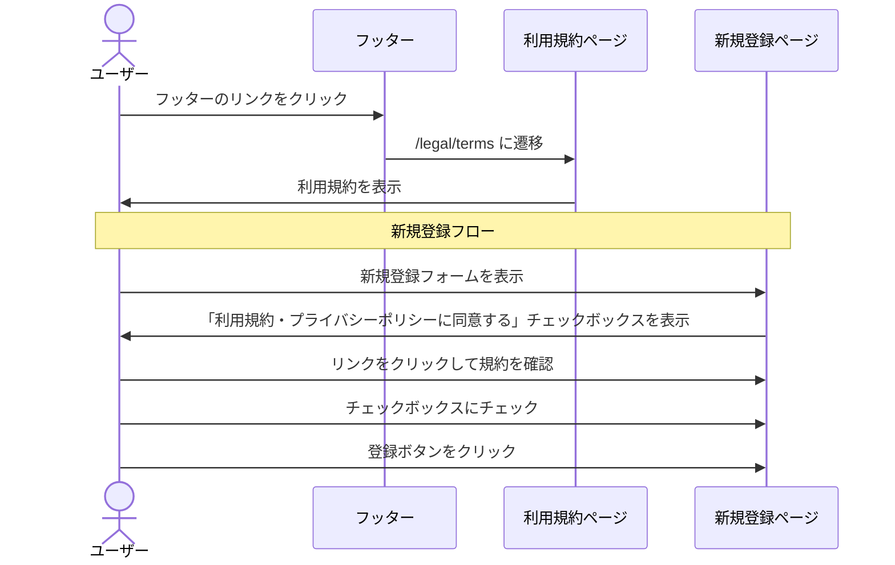

# Spec-25: 利用規約ページ作成

| 項目 | 内容 |
|------|------|
| Issue | [#25 [US-19] 利用規約ページ作成](../../issues/25) |
| ステータス | Draft |
| 作成日 | 2026-03-01 |
| 最終更新 | 2026-03-01 |

---

## 1. 概要

### 背景

InterviewCoach はAI を活用した面接フィードバックサービスであり、AI 分析結果の免責事項、面接データの取り扱い、禁止行為、サブスクリプションの解約条件等を定めた利用規約の整備が不可欠である。ユーザーがサービスの利用ルールを理解した上で安心して利用を開始できるようにする。

### ゴール

- サービスの利用条件を定めた利用規約ページを `/legal/terms` に作成する
- AIフィードバックの免責事項を明確に記載する
- 禁止行為・料金規定・解約条件を網羅する
- 大学生がメインユーザーのため、法律用語を最小限にしわかりやすい日本語で記載する
- ユーザー登録フローに同意チェックボックスを組み込む（プライバシーポリシーと併記）

### スコープ外

- 規約更新時の再同意フロー（v1 では通知のみ）
- 同意履歴の DB 保存（v2 で実装予定）
- 英語版利用規約

---

## 2. ユーザーストーリー

> As a ユーザー, I want 利用規約を確認できる so that サービスの利用ルールを理解した上で利用を開始できる.

---

## 3. 機能要件

### 3.1 基本フロー



### 3.2 代替フロー

- **直接 URL アクセス**: `/legal/terms` に直接アクセスしても問題なく表示される（認証不要）
- **目次からのジャンプ**: ページ上部の目次リンクから各セクションへスクロールできる
- **印刷**: ブラウザの印刷機能で適切にフォーマットされた文書が出力される

### 3.3 エラーフロー

| エラー条件 | 表示メッセージ | 対処 |
|------------|----------------|------|
| 新規登録時に同意チェックなし | 「利用規約・プライバシーポリシーへの同意が必要です」 | チェックボックス横にエラー表示、登録ボタン無効化 |

---

## 4. 受け入れ基準

### 必須記載事項

- [ ] サービスの定義と提供範囲が記載されている
- [ ] 利用資格（年齢制限、アカウント登録要件）が記載されている
- [ ] ユーザーアカウントに関する規定が記載されている
  - 登録情報の正確性の責任
  - アカウントの管理責任（パスワード管理）
  - 一人一アカウントの原則
- [ ] AIフィードバックに関する免責事項が記載されている
  - AI分析結果は参考情報であり合否を保証しない旨
  - フィードバックの正確性・完全性に関する免責
  - AIモデル変更によるフィードバック内容の変化
- [ ] 面接データの取り扱いが記載されている
  - アップロードされた音声スクリプトの所有権はユーザーに帰属
  - AI API への送信についてプライバシーポリシーと連動
  - 他者の面接内容の無断アップロード禁止
- [ ] 禁止行為が記載されている
- [ ] 料金・支払いに関する規定が記載されている
  - 無料プラン・Pro プランの内容
  - 支払い方法（Stripe 経由）
  - 自動更新の仕組み
  - 解約・返金ポリシー
- [ ] サービスの変更・停止・終了に関する規定が記載されている
- [ ] 知的財産権が記載されている
- [ ] 損害賠償の制限が記載されている
- [ ] 準拠法と管轄裁判所が記載されている
- [ ] 規約の改定手続きが記載されている
- [ ] 制定日・最終更新日が記載されている

### UI/UX

- [ ] `/legal/terms` に静的ページとして配置されている
- [ ] フッターからリンクでアクセスできる
- [ ] ユーザー登録フロー内に同意チェックボックスが設置されている（プライバシーポリシーと併記）
- [ ] レスポンシブ対応されている
- [ ] 目次（ページ内リンク）が設置されている
- [ ] 印刷対応のスタイルが適用されている

---

## 5. 技術設計

### 5.1 アーキテクチャ

```mermaid
graph TD
    subgraph Pages
        A[/legal/terms/page.tsx]
        B[/signup/page.tsx]
    end
    subgraph Components
        C[TermsOfServiceContent]
        D[TableOfContents]
        E[ConsentCheckbox]
        F[Footer]
    end
    A --> C
    A --> D
    B --> E
    E -->|link| A
    F -->|link| A
```

### 5.2 ページ・ルート構成

| パス | コンポーネント | 認証 | 説明 |
|------|----------------|------|------|
| `/app/legal/terms/page.tsx` | TermsOfServicePage | 不要 | 利用規約ページ |
| `/app/legal/layout.tsx` | LegalLayout | 不要 | 法務ページ共通レイアウト（#24 と共有） |

### 5.3 UIコンポーネント

| コンポーネント | ファイルパス | 説明 |
|----------------|-------------|------|
| TermsOfServicePage | `src/app/legal/terms/page.tsx` | メインページ（Server Component、静的生成） |
| LegalLayout | `src/app/legal/layout.tsx` | 法務ページ共通レイアウト（#24 と共有） |
| TableOfContents | `src/components/legal/TableOfContents.tsx` | 目次コンポーネント（#24 と共有） |
| ConsentCheckbox | `src/components/auth/ConsentCheckbox.tsx` | 同意チェックボックス（#24 と共有） |

### 5.4 利用規約構成（セクション）

```
第1条 総則
第2条 定義
第3条 利用資格
第4条 アカウント
  4.1 登録
  4.2 管理責任
  4.3 一人一アカウントの原則
第5条 サービス内容
  5.1 無料プラン
  5.2 Pro プラン
第6条 AIフィードバックに関する免責
  6.1 参考情報としての位置付け
  6.2 正確性・完全性の非保証
  6.3 AIモデルの変更
第7条 面接データの取り扱い
  7.1 所有権
  7.2 AI API への送信
  7.3 他者データの無断利用禁止
第8条 料金・支払い
  8.1 プラン料金
  8.2 支払い方法
  8.3 自動更新
  8.4 解約・返金
第9条 禁止行為
第10条 サービスの変更・停止・終了
第11条 知的財産権
第12条 損害賠償の制限
第13条 準拠法・管轄裁判所
第14条 規約の改定
附則
```

### 5.5 静的生成設定

```typescript
// src/app/legal/terms/page.tsx
export const dynamic = 'force-static';
export const revalidate = false;

export const metadata: Metadata = {
  title: '利用規約 | InterviewCoach',
  description: 'InterviewCoach の利用規約',
};
```

### 5.6 共有コンポーネント（#24 プライバシーポリシーと共有）

以下のコンポーネントは #24 と共有して利用する:

| コンポーネント | 共有元 | 説明 |
|----------------|--------|------|
| LegalLayout | #24 | 法務ページの共通レイアウト |
| TableOfContents | #24 | 目次コンポーネント |
| ConsentCheckbox | #24 | 同意チェックボックス |
| 印刷用 CSS | #24 | `@media print` スタイル |

### 5.7 登録フォームの同意チェックボックス（統合）

プライバシーポリシー（#24）と利用規約（#25）の同意を 1 つのチェックボックスで管理する:

```typescript
// 表示テキスト:
// 「利用規約 および プライバシーポリシー に同意する」
// ※「利用規約」「プライバシーポリシー」はそれぞれリンク
```

---

## 6. 依存関係

| 依存先 | 種別 | 説明 |
|--------|------|------|
| なし | - | 独立して実装可能 |

**関連 Issue:**
- #24（プライバシーポリシー）→ 共通レイアウト・コンポーネントを共有。同時実装を推奨
- 登録ページ → 同意チェックボックスの追加が必要（#24 と統合）

---

## 7. テスト計画

| テスト種別 | テスト内容 | 方法 |
|------------|-----------|------|
| 静的ビルド | ページが正常にビルドされる | `npm run build` |
| レンダリング | 全セクション（第1条〜附則）が表示される | React Testing Library |
| 目次 | ページ内リンクが正しいアンカーに遷移する | Playwright |
| レスポンシブ | モバイル/タブレット/デスクトップで読みやすい | 手動 + Playwright |
| 印刷 | 印刷プレビューで適切にフォーマットされる | 手動 |
| フッターリンク | フッターから遷移できる | Playwright |
| 同意チェック | チェックなしで登録ボタンが無効化される | React Testing Library |
| 同意チェック | チェック後に登録ボタンが有効化される | React Testing Library |
| プライバシーポリシーリンク | 規約ページ内からプライバシーポリシーへ遷移可能 | Playwright |
| アクセシビリティ | スクリーンリーダーで読み上げ可能 | axe-core |
| SEO | meta タグが正しく設定されている | 手動 |

---

## 8. リスクと緩和策

| リスク | 影響度 | 発生確率 | 緩和策 |
|--------|--------|----------|--------|
| 法的要件の漏れ | 高 | 中 | 消費者契約法・特定商取引法のチェックリストに基づき記載。将来的に弁護士レビューを推奨 |
| AI 免責事項の不十分さ | 高 | 中 | AI 分析は「参考情報」であることを複数箇所で明記。フィードバックに基づく行動の結果について免責を明示 |
| 解約・返金トラブル | 中 | 中 | 解約ポリシーを明確に記載（月途中解約でも日割りなし、期間終了まで利用可能）。Stripe の自動更新の仕組みを説明 |
| 規約更新時の既存ユーザー対応 | 中 | 中 | 更新日をページに明記。v2 でアプリ内バナー通知・再同意フローを実装予定 |
| 同意履歴の未保存 | 中 | 高 | v1 では同意チェックのみで履歴保存なし。v2 で同意日時・規約バージョンの DB 保存を実装予定 |
| 他者の面接データ無断アップロード | 高 | 低 | 禁止行為として明記。技術的な検出は困難なため、規約違反時のアカウント停止条項で対応 |
