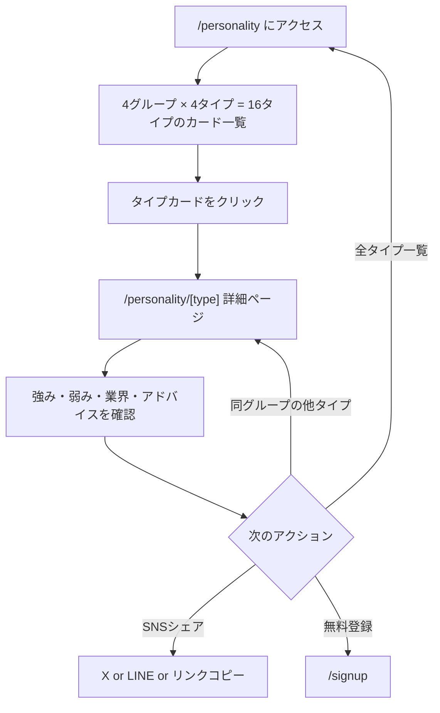
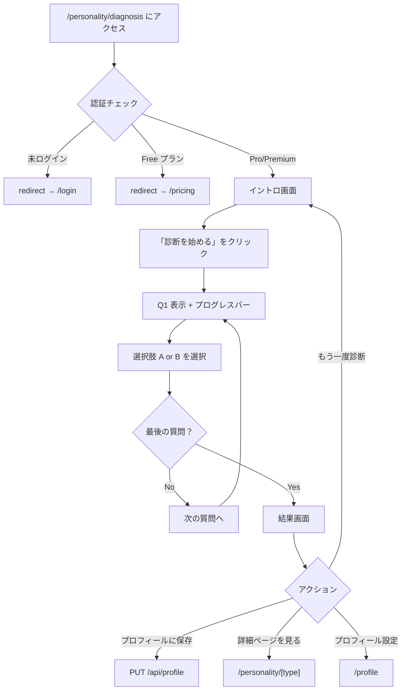

# Spec: 16パーソナリティ診断

| 項目 | 値 |
|------|-----|
| Status | Approved (既存機能) |
| Created | 2026-03-01 |

## 1. 概要

### 1.1 背景

就活において自己分析は重要なステップである。MBTI に着想を得た 16 パーソナリティ分類を面接対策に特化した形で提供し、各タイプの面接での強み・弱み・相性の良い業界を解説することで、ユーザーの自己理解と面接準備を支援する。

### 1.2 ゴール

- 16 のパーソナリティタイプそれぞれに面接特化の解説コンテンツを提供する
- 簡易診断テスト（10 問）でユーザー自身のタイプを判定する
- 診断結果をプロフィールに保存し、他機能（AI フィードバック等）と連携可能にする
- SNS シェア機能でバイラル流入を獲得する

### 1.3 スコープ

- タイプ一覧ページ（4 グループ別表示）
- タイプ詳細ページ（全 16 タイプ分、SSG 対応）
- 診断テストページ（認証 + Pro/Premium 制限）
- プロフィールへの診断結果保存

**スコープ外:**
- 診断結果に基づく AI フィードバックのカスタマイズ（別機能で対応）
- 有料診断テスト（将来拡張候補）

## 2. ユーザーストーリー

- **就活生として**、16 パーソナリティの一覧を見たい。自分がどのタイプに近いか概要を知るためである。
- **就活生として**、各タイプの詳細ページで面接での強み・弱みを知りたい。自分のタイプに合った面接対策をするためである。
- **登録ユーザーとして**、簡易診断テストを受けたい。自分のタイプを客観的に判定するためである。
- **Pro/Premium ユーザーとして**、診断結果をプロフィールに保存したい。AI フィードバックに反映させるためである。
- **就活生として**、診断結果を SNS でシェアしたい。友人にも勧めたいためである。

## 3. 機能要件

### 3.1 ページ構成（URL パス一覧）

| パス | 種別 | 認証 | 説明 |
|------|------|------|------|
| `/personality` | 一覧ページ（Server Component） | 不要 | 4 グループ × 4 タイプの一覧 |
| `/personality/[type]` | 詳細ページ（Server Component + SSG） | 不要 | 各タイプの詳細解説 |
| `/personality/diagnosis` | 診断ページ（Server + Client Component） | 必要（Pro/Premium） | 10 問の診断テスト |

### 3.2 データ構造（型定義の要約）

#### PersonalityType 型（全16タイプ）

```typescript
const PERSONALITY_TYPES = [
  "INTJ", "INTP", "ENTJ", "ENTP",  // 分析家グループ
  "INFJ", "INFP", "ENFJ", "ENFP",  // 外交官グループ
  "ISTJ", "ISFJ", "ESTJ", "ESFJ",  // 番人グループ
  "ISTP", "ISFP", "ESTP", "ESFP",  // 探検家グループ
] as const;
```

#### PersonalityInfo 型

```typescript
interface PersonalityInfo {
  type: PersonalityType;
  name: string;               // オリジナル日本語名
  nameEn: string;              // 英語名
  group: PersonalityGroup;     // 所属グループ
  animal: string;              // 動物名
  animalEmoji: string;         // 動物の絵文字
  color: string;               // テーマカラー (HEX)
  colorLight: string;          // 背景色 (HEX)
  tagline: string;             // キャッチコピー
  description: string;         // 説明文
  strengths: string[];         // 性格の強み
  weaknesses: string[];        // 性格の弱み
  interviewStrengths: string[];  // 面接での強み
  interviewWeaknesses: string[]; // 面接での弱み
  compatibleIndustries: string[]; // 相性の良い業界
  compatibleCultures: string[];   // フィットする企業文化
  talkStyle: string;           // 話し方の特徴
  adviceTip: string;           // ワンポイントアドバイス
}
```

#### PersonalityGroup 型（4グループ）

```typescript
type PersonalityGroup = "analyst" | "diplomat" | "sentinel" | "explorer";

interface PersonalityGroupInfo {
  id: PersonalityGroup;
  name: string;
  nameEn: string;
  color: string;
  colorLight: string;
  description: string;
  types: PersonalityType[];
}
```

#### 全16タイプの名称一覧

| グループ | タイプ | オリジナル名 | 英語名 | 動物 |
|----------|--------|-------------|--------|------|
| 分析家 (analyst) | INTJ | 戦略プランナー | Strategic Planner | フクロウ |
| 分析家 (analyst) | INTP | 知的エクスプローラー | Intellectual Explorer | ネコ |
| 分析家 (analyst) | ENTJ | ビジョンリーダー | Vision Leader | ライオン |
| 分析家 (analyst) | ENTP | アイデアメイカー | Idea Maker | キツネ |
| 外交官 (diplomat) | INFJ | 静かなビジョナリー | Quiet Visionary | シカ |
| 外交官 (diplomat) | INFP | 共感クリエイター | Empathy Creator | ウサギ |
| 外交官 (diplomat) | ENFJ | チームメンター | Team Mentor | イルカ |
| 外交官 (diplomat) | ENFP | パッションスターター | Passion Starter | コアラ |
| 番人 (sentinel) | ISTJ | 堅実キーパー | Steady Keeper | クマ |
| 番人 (sentinel) | ISFJ | サイレントサポーター | Silent Supporter | ペンギン |
| 番人 (sentinel) | ESTJ | 組織キャプテン | Organization Captain | イヌ |
| 番人 (sentinel) | ESFJ | ムードコネクター | Mood Connector | ハムスター |
| 探検家 (explorer) | ISTP | 冷静テクニシャン | Cool Technician | タカ |
| 探検家 (explorer) | ISFP | 感性アーティスト | Sensory Artist | チョウ |
| 探検家 (explorer) | ESTP | 突破パイオニア | Breakthrough Pioneer | チーター |
| 探検家 (explorer) | ESFP | ステージライター | Stage Lighter | インコ |

#### 4グループの定義

| ID | 名前 | 英語名 | カラー | 含まれるタイプ |
|----|------|--------|--------|----------------|
| analyst | 分析家 | Analysts | #7E57C2 | INTJ, INTP, ENTJ, ENTP |
| diplomat | 外交官 | Diplomats | #4CAF50 | INFJ, INFP, ENFJ, ENFP |
| sentinel | 番人 | Sentinels | #1E88E5 | ISTJ, ISFJ, ESTJ, ESFJ |
| explorer | 探検家 | Explorers | #F4511E | ISTP, ISFP, ESTP, ESFP |

#### 診断テストのデータ構造

```typescript
type Axis = "EI" | "SN" | "TF" | "JP";

interface DiagnosisQuestion {
  id: number;
  axis: Axis;
  question: string;
  optionA: DiagnosisOption;
  optionB: DiagnosisOption;
}

interface DiagnosisOption {
  label: string;
  value: string;  // "E", "I", "S", "N", "T", "F", "J", "P"
}

interface DiagnosisResult {
  type: PersonalityType;
  scores: Record<string, number>;
}
```

#### 診断テスト 10 問の構成

| ID | 軸 | 質問テーマ |
|----|-----|-----------|
| 1 | E/I | グループワーク後の感じ方 |
| 2 | E/I | 新しい環境での振る舞い |
| 3 | E/I | アイデアを思いついたときの行動 |
| 4 | S/N | 情報収集で重視すること |
| 5 | S/N | 説明の分かりやすさ |
| 6 | T/F | 友人の悩み相談への対応 |
| 7 | T/F | チームの意見対立時の判断基準 |
| 8 | J/P | 旅行計画の立て方 |
| 9 | J/P | 課題・レポートへの取り組み方 |
| 10 | J/P | 予定外の出来事への反応 |

**軸ごとの問題数:**

| 軸 | 問数 | 説明 |
|----|------|------|
| E/I | 3問 | 外向型 / 内向型 |
| S/N | 2問 | 感覚型 / 直感型 |
| T/F | 2問 | 思考型 / 感情型 |
| J/P | 3問 | 判断型 / 知覚型 |

### 3.3 基本フロー（ユーザー操作の流れ）

#### 一覧ページ → 詳細ページ



#### 診断テスト



### 3.4 代替フロー

- **前の質問に戻る:** 質問回答中に「前の質問に戻る」ボタン（2問目以降で表示）で前の質問に戻れる
- **やり直し:** 結果画面から「もう一度診断する」で全状態がリセットされ、イントロ画面に戻る
- **保存済み状態:** プロフィール保存後、ボタンが「保存しました」（disabled + 緑色）に変わる

### 3.5 エラーフロー

- **存在しない type にアクセス:** `isValidPersonalityType` で検証し、不正なら `notFound()` を呼び出す
- **type パラメータの大文字小文字:** URL は小文字で入力されるが、内部で `toUpperCase()` して照合する
- **プロフィール保存失敗:** API 呼び出しが失敗しても `catch` で静かに処理し、UI にエラーは表示しない（try-catch で握りつぶし）

## 4. 受け入れ基準（壊してはいけないポイント）

### 一覧ページ (`/personality`)

- [ ] `/personality` にアクセスすると 4 グループ × 4 タイプ = 16 タイプのカードが表示される
- [ ] グループの表示順序が `analyst` → `diplomat` → `sentinel` → `explorer` の順である
- [ ] 各グループにグループ名（日本語 + 英語）と説明文が表示される
- [ ] 各グループのカラーバー（`h-1 w-8`）がグループの `color` で表示される
- [ ] 各タイプカードにキャラクター画像（SVG）、タイプコード、名前、英語名、動物、タグラインが表示される
- [ ] 各タイプカードをクリックすると `/personality/[type]`（小文字）に遷移する
- [ ] ページ上部の CTA「無料で診断してみる」が `/signup` にリンクしている
- [ ] ページ下部の CTA「今すぐ診断する（無料登録）」が `/signup` にリンクしている
- [ ] ページ下部の CTA「料金プランを見る」が `/pricing` にリンクしている
- [ ] メタデータ title が「16パーソナリティ診断」である

### 詳細ページ (`/personality/[type]`)

- [ ] 全 16 タイプのページが `generateStaticParams` で静的生成される（小文字 URL）
- [ ] パンくずナビ「16パーソナリティ一覧」が `/personality` にリンクしている
- [ ] ヒーローセクションにキャラクター画像、グループバッジ、タイプバッジ、名前、英語名、動物、タグライン、説明文が表示される
- [ ] SNS シェアボタン（X, LINE, リンクコピー）が機能する
- [ ] 「性格の強み」セクション（緑アイコン）が表示される
- [ ] 「気をつけたいポイント」セクション（黄アイコン）が表示される
- [ ] 「面接での強み」セクション（青アイコン）が表示される
- [ ] 「面接で気をつけること」セクション（赤アイコン）が表示される
- [ ] 「相性の良い業界」セクション（紫アイコン）が表示される
- [ ] 「フィットする企業文化」セクション（藍アイコン）が表示される
- [ ] 「面接コーチからのアドバイス」セクションに「話し方の特徴」と「ワンポイントアドバイス」が表示される
- [ ] 「同じグループのタイプ」セクションに同グループの他 3 タイプが表示される
- [ ] CTA「無料で始める」がタイプのカラーでスタイルされ `/signup` にリンクしている
- [ ] CTA「全タイプを見る」が `/personality` にリンクしている
- [ ] 存在しないタイプ（例: `/personality/xxxx`）にアクセスすると 404 が返る
- [ ] メタデータに title、description、openGraph が動的に設定される

### 診断テストページ (`/personality/diagnosis`)

- [ ] 未ログインユーザーがアクセスすると `/login` にリダイレクトされる
- [ ] Free プランのユーザーがアクセスすると `/pricing` にリダイレクトされる
- [ ] Pro または Premium プランのユーザーのみアクセスできる
- [ ] イントロ画面に 4 軸の説明（E/I, S/N, T/F, J/P）が表示される
- [ ] イントロ画面に「全10問」「所要時間: 約2分」が表示される
- [ ] 「診断を始める」ボタンで質問画面に遷移する
- [ ] 質問画面にプログレスバーが表示され、進行に応じて伸びる
- [ ] 質問番号が「Q1 / 10」〜「Q10 / 10」の形式で表示される
- [ ] 各質問に選択肢 A と B が表示される
- [ ] 選択肢をクリックすると次の質問に自動遷移する
- [ ] 2 問目以降で「前の質問に戻る」ボタンが表示される
- [ ] 10 問全て回答すると結果画面が表示される
- [ ] 結果画面に判定されたタイプの動物絵文字、タイプコード、名前、英語名、グループ名が表示される
- [ ] 結果画面に面接での強み・課題・アドバイスが表示される
- [ ] 「プロフィールに保存する」ボタンで `PUT /api/profile` に `personality_type` を送信する
- [ ] 保存成功後、ボタンが「保存しました」（disabled + 緑）に変わる
- [ ] 「もう一度診断する」ボタンで全状態がリセットされイントロに戻る
- [ ] 結果画面から「[TYPE] の詳細ページを見る」リンクで詳細ページに遷移できる
- [ ] 結果画面から「プロフィール設定に戻る」リンクで `/profile` に遷移できる
- [ ] メタデータの `robots` が `{ index: false, follow: false }` である（noindex）

### 診断ロジック

- [ ] 各質問の回答値が対応する軸のスコアに加算される
- [ ] 各軸で多い方の文字が採用される（E vs I, S vs N, T vs F, J vs P）
- [ ] 同点の場合は先頭文字（E, S, T, J）が採用される
- [ ] 4 軸の結果を連結して 16 タイプのいずれかが決定される
- [ ] `calculatePersonalityType` が `DiagnosisResult` を正しく返す

## 5. 技術設計

### 5.1 ファイル構成

```
src/
├── app/personality/
│   ├── page.tsx                    # 一覧ページ（Server Component）
│   ├── [type]/
│   │   └── page.tsx                # 詳細ページ（Server Component + SSG）
│   └── diagnosis/
│       ├── page.tsx                # 診断ページ（Server Component: 認証チェック）
│       └── diagnosis-client.tsx    # 診断 UI（Client Component）
├── components/personality/
│   ├── personality-card.tsx        # タイプカード（Client Component）
│   └── share-buttons.tsx           # SNS シェアボタン（Client Component）
└── lib/personality/
    ├── types.ts                    # 型定義 + 全16タイプ・4グループのデータ
    └── diagnosis.ts                # 診断質問データ + 判定ロジック
```

### 5.2 データモデル

**静的データ（データベース不使用）:**

| 名前 | ファイル | 説明 |
|------|----------|------|
| `PERSONALITY_TYPES` | types.ts | 全 16 タイプの定数配列 |
| `PERSONALITY_DATA` | types.ts | 全 16 タイプの詳細データ（`Record<PersonalityType, PersonalityInfo>`） |
| `PERSONALITY_GROUPS` | types.ts | 4 グループの定義（`Record<PersonalityGroup, PersonalityGroupInfo>`） |
| `DIAGNOSIS_QUESTIONS` | diagnosis.ts | 診断質問 10 問の配列 |

**ヘルパー関数:**

| 名前 | ファイル | 説明 |
|------|----------|------|
| `isValidPersonalityType(type)` | types.ts | 文字列が有効なタイプかバリデーション |
| `getGroupForType(type)` | types.ts | タイプからグループ情報を取得 |
| `getAllGroups()` | types.ts | 全グループをリストで返す |
| `calculatePersonalityType(answers)` | diagnosis.ts | 回答から性格タイプを算出 |

**データベース連携:**

- 診断結果の保存: `PUT /api/profile` に `{ personality_type: "INTJ" }` を送信
- Supabase の profiles テーブルの `personality_type` カラムに格納

### 5.3 API（使用している場合）

| エンドポイント | メソッド | 用途 | 認証 |
|---------------|---------|------|------|
| `/api/profile` | PUT | 診断結果（personality_type）をプロフィールに保存 | 必要 |

### 5.4 UI コンポーネント構成

**PersonalityCard (`personality-card.tsx`):**
- Client Component（`"use client"`）
- Props: `personality: PersonalityInfo`
- キャラクター画像（`/images/personality/[type].svg`）+ タイプコード + 名前 + 英語名 + 動物 + タグライン
- ホバー時にカードが浮き上がるアニメーション（`hover:-translate-y-1`）

**ShareButtons (`share-buttons.tsx`):**
- Client Component（`"use client"`）
- Props: `type: string`, `name: string`
- シェア先: X (Twitter), LINE, リンクコピー
- シェアテキスト: 「私は{TYPE}（{NAME}）タイプ！面接での強み・弱みを知って対策しよう」
- コピー成功時に「コピーしました！」が 2 秒間表示される

**DiagnosisClient (`diagnosis-client.tsx`):**
- Client Component（`"use client"`）
- 3 フェーズの状態管理: `intro` → `questions` → `result`
- `useState` で管理する状態: `phase`, `currentIndex`, `answers`, `saving`, `saved`
- プログレスバーはパーセンテージ計算で幅を動的変更

### 5.5 SEO 対応（メタデータ、JSON-LD 等）

**一覧ページ:**
- `metadata.title`: "16パーソナリティ診断"
- `metadata.description`: "16パーソナリティタイプから自分の面接スタイルを知ろう！..."
- `metadata.openGraph`: title + description

**詳細ページ:**
- `generateMetadata`: タイプコードと名前を含む動的タイトル・説明文
- `metadata.openGraph`: 動的 title + description
- `generateStaticParams`: 全 16 タイプ（小文字 URL）でページを静的生成

**診断ページ:**
- `metadata.title`: "パーソナリティ診断テスト"
- `metadata.robots`: `{ index: false, follow: false }` — 診断ページは検索エンジンに非公開

## 6. 依存関係

**内部依存:**
- `@/components/ui/button` (shadcn/ui)
- `@/components/ui/card` (shadcn/ui)
- `@/components/personality/personality-card`
- `@/components/personality/share-buttons`
- `@/lib/supabase/server` — 認証チェック
- `@/lib/subscription` — プランチェック（`getUserSubscription`）

**外部依存:**
- `lucide-react`: アイコン（CheckCircle2, AlertTriangle, Building2, Briefcase, MessageCircle, Lightbulb, ArrowLeft, ChevronRight, Loader2, ArrowRight, RotateCcw, Share2）
- `next`: App Router, Metadata, Link, Image, notFound, redirect, useRouter
- `next/image`: キャラクター画像の最適化表示

**静的アセット:**
- `/images/personality/[type].svg` — 各タイプのキャラクター SVG 画像（16 ファイル）

**関連機能への導線:**
- 診断ページ → `/api/profile`（プロフィール保存）
- 一覧・詳細ページ → `/signup`（ユーザー登録）
- 一覧ページ → `/pricing`（料金プラン）
- 診断ページ → `/login`（未認証時リダイレクト）
- 診断ページ → `/pricing`（Free プランリダイレクト）
- 診断ページ → `/profile`（プロフィール設定）

## 7. テスト計画（将来のリグレッションテスト用）

### ユニットテスト

- [ ] `PERSONALITY_TYPES` の要素数が 16 であること
- [ ] `PERSONALITY_DATA` の全 16 タイプにデータが存在すること
- [ ] 各タイプの `name`, `nameEn`, `animal`, `animalEmoji` が空文字でないこと
- [ ] 各タイプの `strengths`, `weaknesses`, `interviewStrengths`, `interviewWeaknesses` が 1 つ以上あること
- [ ] 各タイプの `compatibleIndustries`, `compatibleCultures` が 1 つ以上あること
- [ ] `PERSONALITY_GROUPS` の全 4 グループにデータが存在すること
- [ ] 各グループの `types` に 4 タイプが含まれること
- [ ] 4 グループの合計タイプ数が 16 であること（重複なし）
- [ ] `isValidPersonalityType("INTJ")` が `true` を返すこと
- [ ] `isValidPersonalityType("XXXX")` が `false` を返すこと
- [ ] `isValidPersonalityType("intj")` が `true` を返すこと（大文字変換対応）
- [ ] `getGroupForType("INTJ")` が analyst グループを返すこと
- [ ] `DIAGNOSIS_QUESTIONS` の要素数が 10 であること
- [ ] E/I 軸の質問が 3 問あること
- [ ] S/N 軸の質問が 2 問あること
- [ ] T/F 軸の質問が 2 問あること（注: 実際のデータでは 2 問）
- [ ] J/P 軸の質問が 3 問あること
- [ ] `calculatePersonalityType` で全問 E,S,T,J を選択すると `ESTJ` が返ること
- [ ] `calculatePersonalityType` で全問 I,N,F,P を選択すると `INFP` が返ること
- [ ] 同点の場合に先頭文字（E, S, T, J）が採用されること

### E2E テスト

- [ ] `/personality` ページが正常に表示され、16 タイプが表示される
- [ ] タイプカードクリックで詳細ページに遷移する
- [ ] `/personality/intj` が正常に表示される（小文字 URL）
- [ ] `/personality/INTJ` が大文字でも正常に処理される
- [ ] `/personality/xxxx` で 404 が表示される
- [ ] SNS シェアボタンが正しい URL を生成する
- [ ] 未ログインで `/personality/diagnosis` にアクセスすると `/login` にリダイレクトされる
- [ ] Free プランで `/personality/diagnosis` にアクセスすると `/pricing` にリダイレクトされる
- [ ] Pro プランで診断テストが完了し、結果が表示される
- [ ] 診断結果の保存が成功し、ボタン表示が変わる

## 8. 変更時の注意事項

- **タイプ名・動物名を変更する場合:** `PERSONALITY_DATA` の変更に加え、対応する SVG 画像のファイル名（`/images/personality/[type].svg`）も確認すること
- **新しいグループやタイプを追加する場合:** `PERSONALITY_TYPES` 定数、`PERSONALITY_DATA`、`PERSONALITY_GROUPS` の 3 箇所を同時に更新する必要がある。`generateStaticParams` は `PERSONALITY_TYPES` を参照しているため自動対応。
- **診断質問を変更する場合:** 各軸の質問数バランスが結果に影響する。現在は E/I: 3問、S/N: 2問、T/F: 2問、J/P: 3問。質問数を変えると同点判定ルールの影響範囲が変わる。
- **同点判定ルールを変更する場合:** 現在は `>=` で先頭文字を採用（例: E と I が同点なら E）。このルールの変更は既存ユーザーの再診断結果に影響する。
- **認証・課金制限を変更する場合:** 診断ページの Server Component (`page.tsx`) で `getUserSubscription` を使用。Free プランへの開放はビジネス判断が必要。
- **プロフィール保存を変更する場合:** `PUT /api/profile` の仕様に依存。`personality_type` フィールドの型は `PersonalityType` であること。
- **キャラクター画像を変更する場合:** `/images/personality/[type].svg` のパスと命名規則を維持すること。`next/image` で最適化されるため、SVG 以外のフォーマットに変更する場合は `Image` コンポーネントの設定を確認すること。
- **カラーコードを変更する場合:** 各タイプの `color` と `colorLight` はインラインスタイルで使用されている（Tailwind CSS ではない）。変更時はアクセシビリティ（コントラスト比）を考慮すること。
