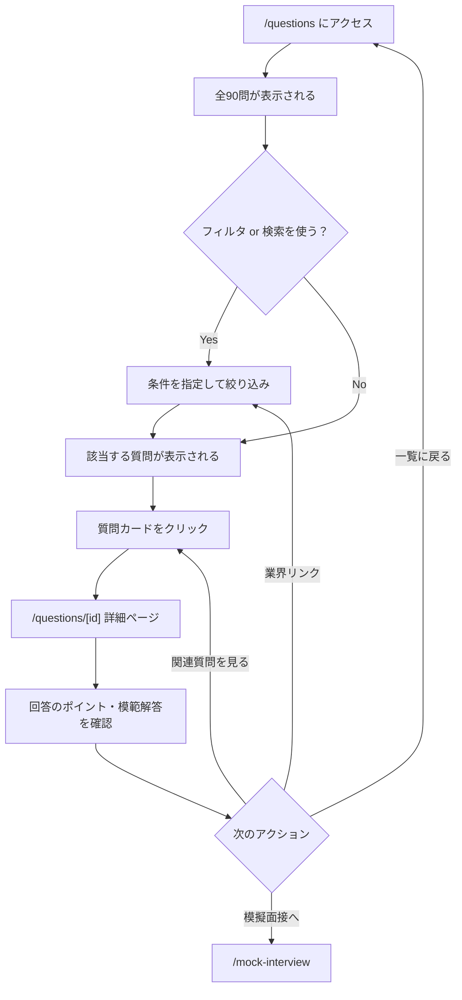

# Spec: 面接質問集

| 項目 | 値 |
|------|-----|
| Status | Approved (既存機能) |
| Created | 2026-03-01 |

## 1. 概要

### 1.1 背景

就活生が面接でよく聞かれる質問を事前に把握し、回答の準備をすることは面接対策の基本である。InterviewCoach では面接頻出質問をデータベース化し、業界・ラウンド・タイプ別に整理したコンテンツを提供している。

### 1.2 ゴール

- 面接でよく聞かれる質問 90 問を体系的に分類・提供する
- 各質問に「回答のポイント」と「模範解答」を付け、実践的な面接対策を支援する
- フィルタ・検索機能で目的の質問に素早くアクセスできるようにする
- SEO 対策を施し、検索エンジン経由の流入を獲得する

### 1.3 スコープ

- 質問一覧ページ（フィルタ・検索付き）
- 質問詳細ページ（回答のポイント・模範解答・関連質問）
- 静的サイト生成（SSG）による全質問ページの事前ビルド
- JSON-LD 構造化データによる SEO 対応

**スコープ外:**
- ユーザーによる質問の追加・編集
- 認証・課金制限（本機能は全ユーザーに公開）

## 2. ユーザーストーリー

- **就活生として**、業界別・ラウンド別に面接質問を絞り込みたい。準備すべき質問を効率的に見つけるためである。
- **就活生として**、各質問の回答のポイントと模範解答を読みたい。自分の回答を作成する参考にするためである。
- **就活生として**、キーワードで質問を検索したい。特定のテーマの質問をすぐに見つけるためである。
- **就活生として**、関連する質問を見たい。同じカテゴリの質問をまとめて対策するためである。

## 3. 機能要件

### 3.1 ページ構成（URL パス一覧）

| パス | 種別 | 説明 |
|------|------|------|
| `/questions` | 一覧ページ（Server Component） | 全90問の一覧 + フィルタ・検索 |
| `/questions/[id]` | 詳細ページ（Server Component + SSG） | 各質問の詳細（ポイント・模範解答） |

### 3.2 データ構造（型定義の要約）

#### Question 型 (`src/lib/questions/types.ts`)

```typescript
interface Question {
  id: string;            // "q001" 形式（q001 ~ q090）
  question: string;      // 質問文
  industry: Industry[];  // 対象業界（複数選択可）
  round: Round[];        // 対象ラウンド（複数選択可）
  type: QuestionType;    // 質問タイプ（1つ）
  difficulty: Difficulty; // 難易度
  tips: string[];        // 回答のポイント（複数）
  exampleAnswer: string; // 模範解答
  keywords: string[];    // SEO キーワード
}
```

#### Industry 型（全10業界）

```typescript
type Industry =
  | "IT" | "金融" | "コンサル" | "メーカー" | "商社"
  | "広告" | "人材" | "不動産" | "公務員" | "その他";
```

#### Round 型（全5ラウンド）

```typescript
type Round = "1次" | "2次" | "最終" | "GD" | "ケース";
```

#### QuestionType 型（全8タイプ）

```typescript
type QuestionType =
  | "自己PR" | "志望動機" | "ガクチカ" | "逆質問"
  | "長所短所" | "キャリア" | "業界理解" | "その他";
```

#### Difficulty 型

```typescript
type Difficulty = "easy" | "normal" | "hard";

const DIFFICULTY_LABELS: Record<Difficulty, string> = {
  easy: "基本",
  normal: "標準",
  hard: "応用",
};
```

#### 質問数の内訳（全90問）

| タイプ | 問数 | ID 範囲 |
|--------|------|---------|
| 自己PR | 10問 | q001 - q010 |
| 志望動機 | 10問 | q011 - q020 |
| ガクチカ | 10問 | q021 - q030 |
| 逆質問 | 10問 | q031 - q040 |
| 長所短所 | 10問 | q041 - q050 |
| キャリア | 10問 | q051 - q060 |
| 業界理解 | 15問 | q061 - q075 |
| その他 | 15問 | q076 - q090 |
| **合計** | **90問** | |

### 3.3 基本フロー（ユーザー操作の流れ）



### 3.4 代替フロー

- **フィルタ結果が 0 件の場合:** 「条件に一致する質問が見つかりませんでした。フィルタ条件を変更してお試しください」メッセージを表示
- **URL パラメータでの直接フィルタ:** `/questions?industry=IT` や `/questions?type=自己PR` で直接フィルタ指定可能（詳細ページのサイドバーリンクから遷移）

### 3.5 エラーフロー

- **存在しない質問IDにアクセス:** `notFound()` を呼び出し、404 ページを表示
- **`getQuestionById` が `undefined` を返す場合:** 同上

## 4. 受け入れ基準（壊してはいけないポイント）

- [ ] `/questions` にアクセスすると全 90 問が表示される
- [ ] 画面上部に「全 90 問 収録」と表示される
- [ ] 業界フィルタ（10業界）が正しく動作し、選択した業界の質問のみ表示される
- [ ] ラウンドフィルタ（5ラウンド）が正しく動作する
- [ ] タイプフィルタ（8タイプ）が正しく動作する
- [ ] キーワード検索が質問文に対して部分一致で動作する
- [ ] フィルタの複合条件（業界 + ラウンド + タイプ + キーワード）が AND 条件で正しく動作する
- [ ] フィルタをトグル操作（同じフィルタを再クリック）で解除できる
- [ ] 「フィルタをクリア」ボタンで全フィルタがリセットされる
- [ ] フィルタ結果 0 件の場合に空状態メッセージが表示される
- [ ] 質問カードに「タイプ」「難易度ラベル」「ラウンド」「回答ポイント数」が表示される
- [ ] 難易度の色分けが正しい（基本: 緑、標準: 黄、応用: 赤）
- [ ] `/questions/[id]` に遷移すると質問の詳細が表示される
- [ ] 詳細ページに「回答のポイント」セクションがある
- [ ] 詳細ページに「模範解答」セクションがある
- [ ] 詳細ページに「この質問で模擬面接を練習する」CTA がある（リンク先: `/mock-interview`）
- [ ] サイドバーに「対象業界」がバッジで表示され、各業界をクリックすると一覧ページへフィルタ付きで遷移する
- [ ] サイドバーに同じタイプの「関連する質問」が最大 3 件表示される
- [ ] サイドバーに「カテゴリから探す」リンクが全 8 タイプ分表示される
- [ ] 存在しない質問 ID（例: `/questions/q999`）にアクセスすると 404 が返る
- [ ] パンくずナビ「面接質問集に戻る」リンクが `/questions` に遷移する
- [ ] `generateStaticParams` で全 90 問のページが静的生成される
- [ ] 一覧ページのメタデータ title が「面接質問集」である
- [ ] 一覧ページに JSON-LD（FAQPage、先頭 10 問）が出力される
- [ ] 詳細ページに JSON-LD（QAPage）が出力される
- [ ] 詳細ページのメタデータに `keywords` が含まれる

## 5. 技術設計

### 5.1 ファイル構成

```
src/
├── app/questions/
│   ├── page.tsx               # 一覧ページ（Server Component）
│   ├── question-filter.tsx    # フィルタコンポーネント（Client Component "use client"）
│   └── [id]/
│       └── page.tsx           # 詳細ページ（Server Component + SSG）
└── lib/questions/
    ├── types.ts               # 型定義 + 定数
    └── data.ts                # 質問データ（90問）+ ヘルパー関数
```

### 5.2 データモデル

データは全てクライアントサイドの静的定数として `src/lib/questions/data.ts` に定義されている（データベース不使用）。

**エクスポートされる定数・関数:**

| 名前 | 種別 | 説明 |
|------|------|------|
| `questions` | `Question[]` | 全 90 問の配列 |
| `getQuestionById(id)` | 関数 | ID で質問を検索 |
| `filterQuestions(filters)` | 関数 | 条件で質問をフィルタ |
| `INDUSTRIES` | `Industry[]` | 全 10 業界の定数配列 |
| `ROUNDS` | `Round[]` | 全 5 ラウンドの定数配列 |
| `QUESTION_TYPES` | `QuestionType[]` | 全 8 タイプの定数配列 |
| `DIFFICULTY_LABELS` | `Record` | 難易度ラベルのマッピング |

### 5.3 API（使用している場合）

本機能では API は使用していない。全てのデータは静的に定義されている。

### 5.4 UI コンポーネント構成

**一覧ページ (`page.tsx`):**
- Server Component
- `BookOpen` アイコン + タイトル + 説明文 + 総数表示
- `QuestionFilter` コンポーネントを配置

**フィルタコンポーネント (`question-filter.tsx`):**
- Client Component (`"use client"`)
- `useState` で 4 つのフィルタ状態を管理: `search`, `selectedIndustry`, `selectedRound`, `selectedType`
- `useMemo` でフィルタ結果を計算
- フィルタ UI: テキスト検索 + 業界ボタン群 + ラウンドボタン群 + タイプボタン群
- 結果件数の表示
- 質問カード一覧（3 カラムグリッド: `sm:grid-cols-2 lg:grid-cols-3`）

**詳細ページ (`[id]/page.tsx`):**
- Server Component
- 2 カラムレイアウト（メイン `lg:col-span-2` + サイドバー）
- 使用コンポーネント: `Card`, `CardContent`, `CardHeader`, `CardTitle`, `Badge`, `Button`
- 使用アイコン: `ArrowLeft`, `BookOpen`, `CheckCircle`, `Lightbulb`, `Mic`, `Tag`, `ChevronRight`

### 5.5 SEO 対応（メタデータ、JSON-LD 等）

**一覧ページ:**
- `metadata.title`: "面接質問集"
- `metadata.description`: "面接でよく聞かれる質問90問を業界別・ラウンド別・タイプ別に整理..."
- `metadata.openGraph`: title + description
- JSON-LD: `FAQPage` スキーマ（先頭 10 問を `mainEntity` に含む）

**詳細ページ:**
- `generateMetadata`: 質問文を含む動的タイトル・説明文
- `metadata.keywords`: 各質問の `keywords` 配列
- `metadata.openGraph`: 動的 title + description
- JSON-LD: `QAPage` スキーマ（質問と模範解答）
- `generateStaticParams`: 全 90 問の ID でページを静的生成

## 6. 依存関係

**内部依存:**
- `@/components/ui/input` (shadcn/ui)
- `@/components/ui/badge` (shadcn/ui)
- `@/components/ui/button` (shadcn/ui)
- `@/components/ui/card` (shadcn/ui)

**外部依存:**
- `lucide-react`: アイコン
- `next`: App Router, Metadata, Link, Image, notFound

**関連機能への導線:**
- 詳細ページの CTA から `/mock-interview`（模擬面接）への遷移リンク

## 7. テスト計画（将来のリグレッションテスト用）

### ユニットテスト

- [ ] `questions` 配列の要素数が 90 であること
- [ ] 全質問の `id` が `q001` 〜 `q090` の連番であること
- [ ] 全質問の `id` が一意であること
- [ ] 全質問の `industry` が `INDUSTRIES` 定数に含まれること
- [ ] 全質問の `round` が `ROUNDS` 定数に含まれること
- [ ] 全質問の `type` が `QUESTION_TYPES` 定数に含まれること
- [ ] 全質問の `difficulty` が `easy` | `normal` | `hard` のいずれかであること
- [ ] 全質問の `tips` が 1 つ以上あること
- [ ] 全質問の `exampleAnswer` が空文字でないこと
- [ ] `getQuestionById("q001")` が正しい質問を返すこと
- [ ] `getQuestionById("q999")` が `undefined` を返すこと
- [ ] `filterQuestions({ industry: "IT" })` が正しくフィルタされること
- [ ] `filterQuestions({ type: "自己PR" })` が 10 件を返すこと

### E2E テスト

- [ ] `/questions` ページが正常に表示される
- [ ] フィルタを操作して結果が動的に変わる
- [ ] 質問カードクリックで詳細ページに遷移する
- [ ] `/questions/q001` が正常に表示される
- [ ] `/questions/invalid` で 404 が表示される
- [ ] パンくずリンクで一覧ページに戻れる

## 8. 変更時の注意事項

- **質問数を変更する場合:** `questions` 配列の要素数が変わると一覧ページの「全 X 問 収録」表示と SEO 用の description に影響する
- **質問 ID の形式を変更する場合:** `generateStaticParams` と全内部リンクに影響するため、既存の ID パターン `q001` を維持すること
- **型定義を変更する場合:** `Industry`, `Round`, `QuestionType`, `Difficulty` の変更は data.ts 内の全質問データとフィルタ UI に影響する
- **フィルタロジックを変更する場合:** `useMemo` 内のフィルタロジックは AND 条件で動作しており、OR 条件への変更はユーザー体験に大きな影響を与える
- **JSON-LD を変更する場合:** Google のリッチリザルトに影響するため、schema.org の仕様に準拠すること
- **data.ts のファイルサイズ:** 現在約 1500 行。質問を大幅に追加する場合はファイル分割やデータベース化を検討すること
- **SSG に関する注意:** `generateStaticParams` で全質問ページをビルド時に生成しているため、質問の追加・削除時は再ビルドが必要
